## Instructions
Answer the following questions and complete the exercises in RMarkdown. Please embed all of your code and push your final work to your repository. Your final lab report should be organized, clean, and run free from errors. Remember, you must remove the `#` for the included code chunks to run. Be sure to add your name to the author header above. For any included plots, make sure they are clearly labeled. You are free to use any plot type that you feel best communicates the results of your analysis.  

**In this homework, you should make use of the aesthetics you have learned. It's OK to be flashy!**

Make sure to use the formatting conventions of RMarkdown to make your report neat and clean!  

## Load the libraries

```r
library(tidyverse)
library(janitor)
library(here)
library(naniar)
library(ggthemes)
```

## Resources
The idea for this assignment came from [Rebecca Barter's](http://www.rebeccabarter.com/blog/2017-11-17-ggplot2_tutorial/) ggplot tutorial so if you get stuck this is a good place to have a look.  

## Gapminder
For this assignment, we are going to use the dataset [gapminder](https://cran.r-project.org/web/packages/gapminder/index.html). Gapminder includes information about economics, population, and life expectancy from countries all over the world. You will need to install it before use. This is the same data that we will use for midterm 2 so this is good practice.

```r
#install.packages("gapminder")
library("gapminder")
```

## Questions
The questions below are open-ended and have many possible solutions. Your approach should, where appropriate, include numerical summaries and visuals. Be creative; assume you are building an analysis that you would ultimately present to an audience of stakeholders. Feel free to try out different `geoms` if they more clearly present your results.  

**1. Use the function(s) of your choice to get an idea of the overall structure of the data frame, including its dimensions, column names, variable classes, etc. As part of this, determine how NA's are treated in the data.**  

```r
str(gapminder)
```

```
## tibble [1,704 × 6] (S3: tbl_df/tbl/data.frame)
##  $ country  : Factor w/ 142 levels "Afghanistan",..: 1 1 1 1 1 1 1 1 1 1 ...
##  $ continent: Factor w/ 5 levels "Africa","Americas",..: 3 3 3 3 3 3 3 3 3 3 ...
##  $ year     : int [1:1704] 1952 1957 1962 1967 1972 1977 1982 1987 1992 1997 ...
##  $ lifeExp  : num [1:1704] 28.8 30.3 32 34 36.1 ...
##  $ pop      : int [1:1704] 8425333 9240934 10267083 11537966 13079460 14880372 12881816 13867957 16317921 22227415 ...
##  $ gdpPercap: num [1:1704] 779 821 853 836 740 ...
```

```r
dim(gapminder)
```

```
## [1] 1704    6
```

```r
summary(gapminder)
```

```
##         country        continent        year         lifeExp     
##  Afghanistan:  12   Africa  :624   Min.   :1952   Min.   :23.60  
##  Albania    :  12   Americas:300   1st Qu.:1966   1st Qu.:48.20  
##  Algeria    :  12   Asia    :396   Median :1980   Median :60.71  
##  Angola     :  12   Europe  :360   Mean   :1980   Mean   :59.47  
##  Argentina  :  12   Oceania : 24   3rd Qu.:1993   3rd Qu.:70.85  
##  Australia  :  12                  Max.   :2007   Max.   :82.60  
##  (Other)    :1632                                                
##       pop              gdpPercap       
##  Min.   :6.001e+04   Min.   :   241.2  
##  1st Qu.:2.794e+06   1st Qu.:  1202.1  
##  Median :7.024e+06   Median :  3531.8  
##  Mean   :2.960e+07   Mean   :  7215.3  
##  3rd Qu.:1.959e+07   3rd Qu.:  9325.5  
##  Max.   :1.319e+09   Max.   :113523.1  
## 
```

```r
anyNA(gapminder)
```

```
## [1] FALSE
```

**2. Among the interesting variables in gapminder is life expectancy. How has global life expectancy changed between 1952 and 2007?**

```r
global_life_exp <- gapminder %>%
  group_by(year) %>%
  summarise(mean_life_exp = mean(lifeExp))
```

```
## `summarise()` ungrouping output (override with `.groups` argument)
```

```r
global_life_exp
```

```
## # A tibble: 12 x 2
##     year mean_life_exp
##    <int>         <dbl>
##  1  1952          49.1
##  2  1957          51.5
##  3  1962          53.6
##  4  1967          55.7
##  5  1972          57.6
##  6  1977          59.6
##  7  1982          61.5
##  8  1987          63.2
##  9  1992          64.2
## 10  1997          65.0
## 11  2002          65.7
## 12  2007          67.0
```


```r
global_life_exp %>%
  ggplot(aes(x = year, y = mean_life_exp, fill = year))+
  geom_col()+
  theme(axis.text.x = element_text(angle = 60, hjust = 1), plot.title = element_text(hjust = 0.5)) +
  labs(title = "Global Life Expectancy between 1952 and 2007",
       x = "Year",
       y= "Average Life Expectancy")
```

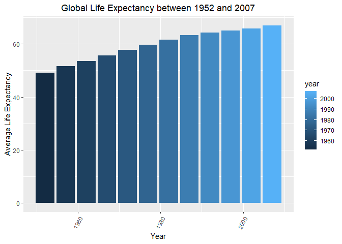<!-- -->

**3. How do the distributions of life expectancy compare for the years 1952 and 2007?**

```r
gapminder$year<-as.factor(gapminder$year)
```


```r
gapminder %>%
  filter(year == 1952 | year == 2007) %>%
  ggplot(aes(x = year, y = lifeExp))+
  geom_boxplot()+
  theme(axis.text.x = element_text(angle = 60, hjust = 1), plot.title = element_text(hjust = 0.5)) +
  labs(title = "Life Expectancy Distribution: 1952 and 2007",
       x = "Year",
       y= "Life Expectancy")
```

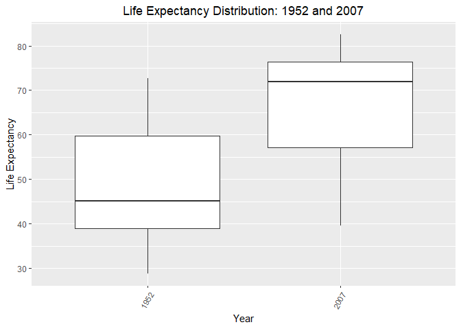<!-- -->

**4. Your answer above doesn't tell the whole story since life expectancy varies by region. Make a summary that shows the min, mean, and max life expectancy by continent for all years represented in the data.**

```r
gapminder_summary <- gapminder %>%
  group_by(year, continent) %>%
  summarise(min_life_exp = min(lifeExp),
            mean_life_exp = mean(lifeExp),
            max_life_exp = max(lifeExp))
```

```
## `summarise()` regrouping output by 'year' (override with `.groups` argument)
```

```r
gapminder_summary
```

```
## # A tibble: 60 x 5
## # Groups:   year [12]
##    year  continent min_life_exp mean_life_exp max_life_exp
##    <fct> <fct>            <dbl>         <dbl>        <dbl>
##  1 1952  Africa            30            39.1         52.7
##  2 1952  Americas          37.6          53.3         68.8
##  3 1952  Asia              28.8          46.3         65.4
##  4 1952  Europe            43.6          64.4         72.7
##  5 1952  Oceania           69.1          69.3         69.4
##  6 1957  Africa            31.6          41.3         58.1
##  7 1957  Americas          40.7          56.0         70.0
##  8 1957  Asia              30.3          49.3         67.8
##  9 1957  Europe            48.1          66.7         73.5
## 10 1957  Oceania           70.3          70.3         70.3
## # … with 50 more rows
```


```r
gapminder %>%
  ggplot(aes(x = year, y = lifeExp, fill = continent))+
  geom_boxplot()+
  theme(axis.text.x = element_text(angle = 60, hjust = 1), plot.title = element_text(hjust = 0.5)) +
  labs(title = "Life Expectancy by Continents",
       x = "Year",
       y= "Life Expectancy")
```

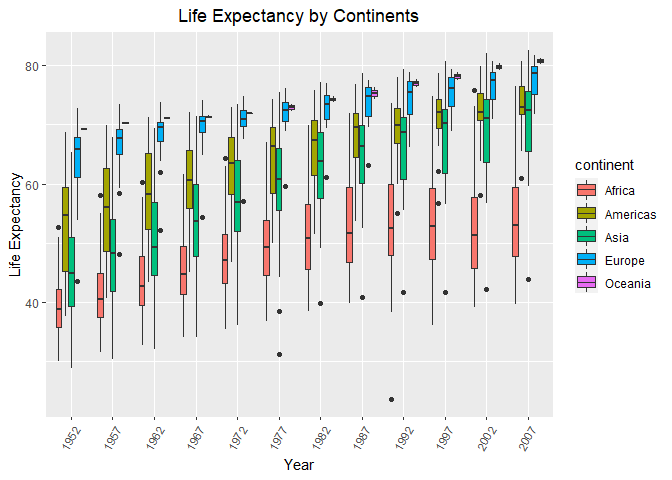<!-- -->


```r
gapminder_summary %>%
  ggplot(aes(x = year, y = min_life_exp, color = continent))+
  geom_point(shape = 1)+
  theme(axis.text.x = element_text(angle = 60, hjust = 1), plot.title = element_text(hjust = 0.5)) +
  labs(title = "Min Life Expectancy by Continents",
       x = "Year",
       y= "Life Expectancy")
```

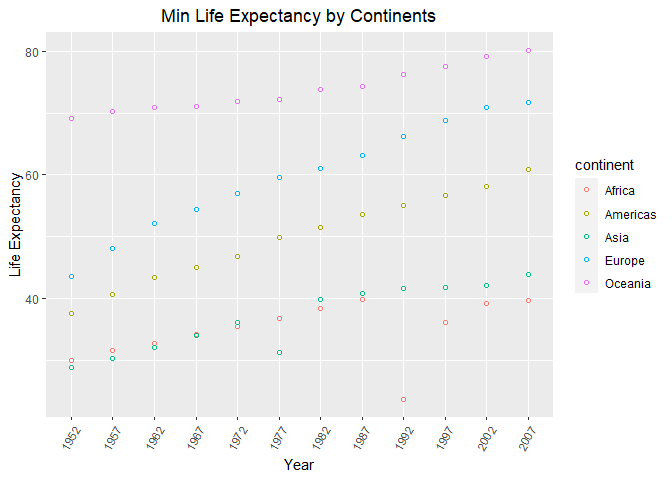<!-- -->


```r
gapminder_summary %>%
  ggplot(aes(x = year, y = mean_life_exp, color = continent))+
  geom_point(shape = 2)+
  theme(axis.text.x = element_text(angle = 60, hjust = 1), plot.title = element_text(hjust = 0.5)) +
  labs(title = "Mean Life Expectancy by Continents",
       x = "Year",
       y= "Life Expectancy")
```

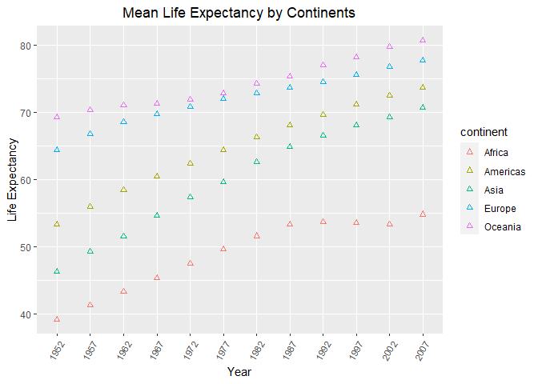<!-- -->


```r
gapminder_summary %>%
  ggplot(aes(x = year, y = mean_life_exp, color = continent))+
  geom_point(shape = 5)+
  theme(axis.text.x = element_text(angle = 60, hjust = 1), plot.title = element_text(hjust = 0.5)) +
  labs(title = "Max Life Expectancy by Continents",
       x = "Year",
       y= "Life Expectancy")
```

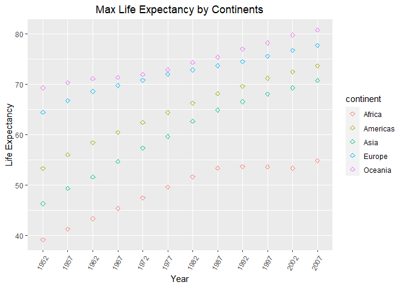<!-- -->

**5. How has life expectancy changed between 1952-2007 for each continent?**

```r
gapminder_summary %>%
  ggplot(aes(x = year, group = continent, y = mean_life_exp, color = continent))+
  geom_line()+
  geom_point()+
  theme(axis.text.x = element_text(angle = 60, hjust = 1), plot.title = element_text(hjust = 0.5)) +
  labs(title = "Mean Life Expectancy by Continents",
       x = "Year",
       y= "Life Expectancy")
```

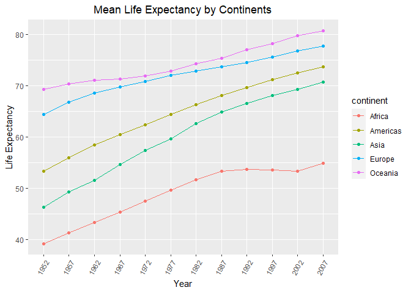<!-- -->

**6. We are interested in the relationship between per capita GDP and life expectancy; i.e. does having more money help you live longer?**

```r
gapminder %>%
  ggplot(aes(x = log10(gdpPercap), y = lifeExp, color = continent))+
  geom_point()+
  theme(axis.text.x = element_text(angle = 60, hjust = 1), plot.title = element_text(hjust = 0.5)) +
  labs(title = "GDP vs Life Expectancy by Continent",
       x = "GDP per capita (log10)",
       y= "Life Expectancy")
```

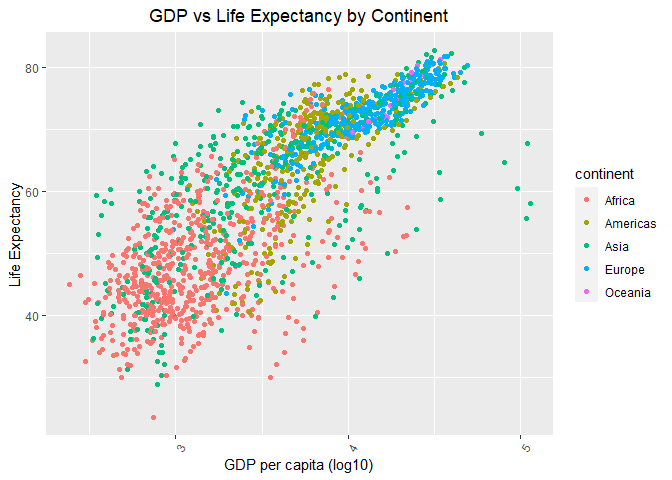<!-- -->


**7. Which countries have had the largest population growth since 1952?**

```r
gapminder_diff <- gapminder%>%
  group_by(country)%>%
  filter(year==1952 | year==2007)%>%
  mutate(pop_growth = pop - lag(pop, default = first(pop)))
gapminder_diff
```

```
## # A tibble: 284 x 7
## # Groups:   country [142]
##    country     continent year  lifeExp      pop gdpPercap pop_growth
##    <fct>       <fct>     <fct>   <dbl>    <int>     <dbl>      <int>
##  1 Afghanistan Asia      1952     28.8  8425333      779.          0
##  2 Afghanistan Asia      2007     43.8 31889923      975.   23464590
##  3 Albania     Europe    1952     55.2  1282697     1601.          0
##  4 Albania     Europe    2007     76.4  3600523     5937.    2317826
##  5 Algeria     Africa    1952     43.1  9279525     2449.          0
##  6 Algeria     Africa    2007     72.3 33333216     6223.   24053691
##  7 Angola      Africa    1952     30.0  4232095     3521.          0
##  8 Angola      Africa    2007     42.7 12420476     4797.    8188381
##  9 Argentina   Americas  1952     62.5 17876956     5911.          0
## 10 Argentina   Americas  2007     75.3 40301927    12779.   22424971
## # … with 274 more rows
```


```r
gapminder_diff %>%
  arrange(desc(pop_growth))
```

```
## # A tibble: 284 x 7
## # Groups:   country [142]
##    country       continent year  lifeExp        pop gdpPercap pop_growth
##    <fct>         <fct>     <fct>   <dbl>      <int>     <dbl>      <int>
##  1 China         Asia      2007     73.0 1318683096     4959.  762419569
##  2 India         Asia      2007     64.7 1110396331     2452.  738396331
##  3 United States Americas  2007     78.2  301139947    42952.  143586947
##  4 Indonesia     Asia      2007     70.6  223547000     3541.  141495000
##  5 Brazil        Americas  2007     72.4  190010647     9066.  133408087
##  6 Pakistan      Asia      2007     65.5  169270617     2606.  127924057
##  7 Bangladesh    Asia      2007     64.1  150448339     1391.  103561480
##  8 Nigeria       Africa    2007     46.9  135031164     2014.  101912068
##  9 Mexico        Americas  2007     76.2  108700891    11978.   78556574
## 10 Philippines   Asia      2007     71.7   91077287     3190.   68638596
## # … with 274 more rows
```

**8. Use your results from the question above to plot population growth for the top five countries since 1952.**

```r
gapminder_diff %>%
  filter(pop_growth > 127924057) %>%
  ggplot(aes(x = country, y = pop_growth, fill = country))+
  geom_col()+
  theme(axis.text.x = element_text(angle = 60, hjust = 1), plot.title = element_text(hjust = 0.5)) +
  labs(title = "Countries with Largest Population Growth",
       x = "Country",
       y= "Population Growth")
```

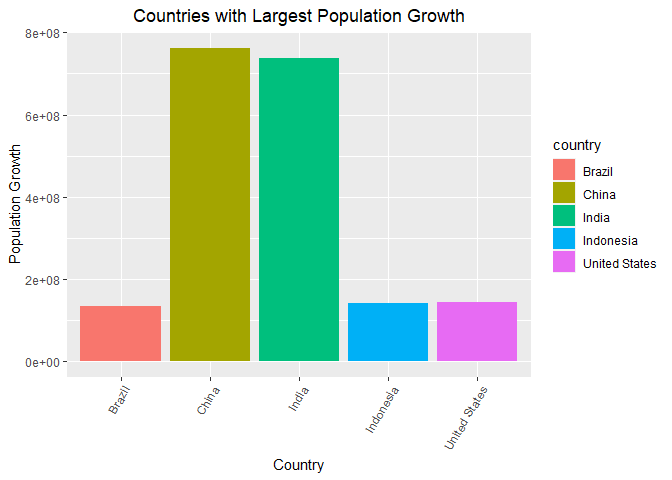<!-- -->

**9. How does per-capita GDP growth compare between these same five countries?**

```r
gapminder %>%
  filter(country == "Brazil" | country == "China" | country == "India" | country == "Indonesia" | country == "United States") %>%
  ggplot(aes(x = year, y = gdpPercap, group = country, color = country, shape = country))+
  geom_line()+
  geom_point()+
  theme(axis.text.x = element_text(angle = 60, hjust = 1), plot.title = element_text(hjust = 0.5)) +
  labs(title = "Countries with Largest Population Growth",
       x = "Country",
       y= "Population Growth")
```

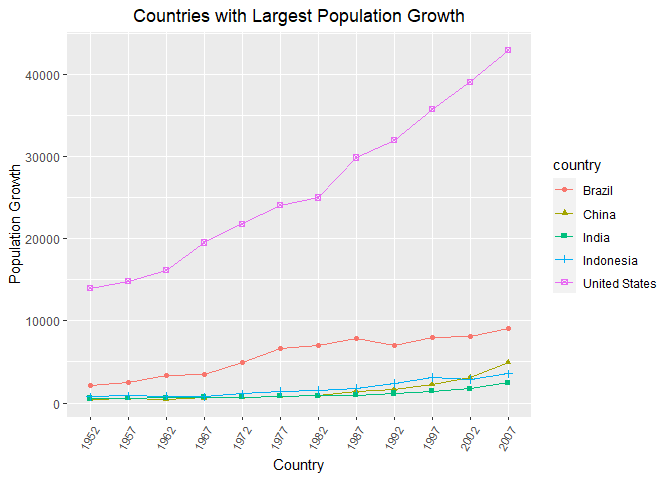<!-- -->

**10. Make one plot of your choice that uses faceting!**
GDP Distribution among continents:

```r
p <- gapminder %>%
  ggplot(aes(x = log10(gdpPercap)))+
  geom_density()
```

```r
p + facet_wrap(~continent)+
  theme(axis.text.x = element_text(angle = 60, hjust = 1), plot.title = element_text(hjust = 0.5)) +
  labs(title = "GDP Distrubution among Continents",
       x = "GDP Per Cap (log10)",
       y= "Density")
```

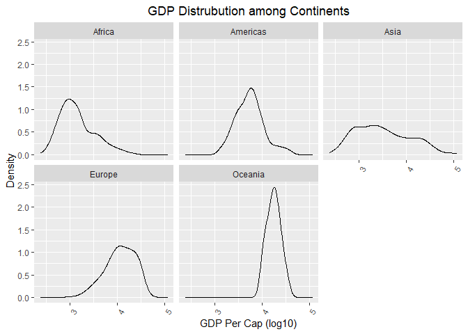<!-- -->

## Push your final code to GitHub!
Please be sure that you check the `keep md` file in the knit preferences. 
