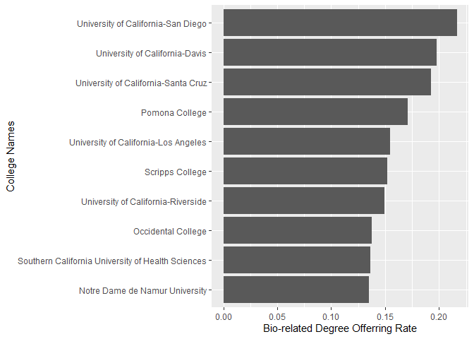

## Instructions
Answer the following questions and complete the exercises in RMarkdown. Please embed all of your code and push your final work to your repository. Your final lab report should be organized, clean, and run free from errors. Remember, you must remove the `#` for the included code chunks to run. Be sure to add your name to the author header above.  

Make sure to use the formatting conventions of RMarkdown to make your report neat and clean!  

## Load the libraries

```r
library(tidyverse)
library(janitor)
library(here)
library(naniar)
```

For this homework, we will take a departure from biological data and use data about California colleges. These data are a subset of the national college scorecard (https://collegescorecard.ed.gov/data/). Load the `ca_college_data.csv` as a new object called `colleges`.

```r
colleges <- readr::read_csv("data/ca_college_data.csv")
```

```
## 
## -- Column specification --------------------------------------------------------
## cols(
##   INSTNM = col_character(),
##   CITY = col_character(),
##   STABBR = col_character(),
##   ZIP = col_character(),
##   ADM_RATE = col_double(),
##   SAT_AVG = col_double(),
##   PCIP26 = col_double(),
##   COSTT4_A = col_double(),
##   C150_4_POOLED = col_double(),
##   PFTFTUG1_EF = col_double()
## )
```

```r
view(colleges)
```

The variables are a bit hard to decipher, here is a key:  

INSTNM: Institution name  
CITY: California city  
STABBR: Location state  
ZIP: Zip code  
ADM_RATE: Admission rate  
SAT_AVG: SAT average score  
PCIP26: Percentage of degrees awarded in Biological And Biomedical Sciences  
COSTT4_A: Annual cost of attendance  
C150_4_POOLED: 4-year completion rate  
PFTFTUG1_EF: Percentage of undergraduate students who are first-time, full-time degree/certificate-seeking undergraduate students  

1. Use your preferred function(s) to have a look at the data and get an idea of its structure. Make sure you summarize NA's and determine whether or not the data are tidy. You may also consider dealing with any naming issues.

```r
skimr::skim(colleges)
```


Table: Data summary

|                         |         |
|:------------------------|:--------|
|Name                     |colleges |
|Number of rows           |341      |
|Number of columns        |10       |
|_______________________  |         |
|Column type frequency:   |         |
|character                |4        |
|numeric                  |6        |
|________________________ |         |
|Group variables          |None     |


**Variable type: character**

|skim_variable | n_missing| complete_rate| min| max| empty| n_unique| whitespace|
|:-------------|---------:|-------------:|---:|---:|-----:|--------:|----------:|
|INSTNM        |         0|             1|  10|  63|     0|      341|          0|
|CITY          |         0|             1|   4|  19|     0|      161|          0|
|STABBR        |         0|             1|   2|   2|     0|        3|          0|
|ZIP           |         0|             1|   5|  10|     0|      324|          0|


**Variable type: numeric**

|skim_variable | n_missing| complete_rate|     mean|       sd|      p0|      p25|      p50|      p75|     p100|hist  |
|:-------------|---------:|-------------:|--------:|--------:|-------:|--------:|--------:|--------:|--------:|:-----|
|ADM_RATE      |       240|          0.30|     0.59|     0.23|    0.08|     0.46|     0.64|     0.75|     1.00|▂▃▆▇▃ |
|SAT_AVG       |       276|          0.19|  1112.31|   170.80|  870.00|   985.00|  1078.00|  1237.00|  1555.00|▇▇▅▂▂ |
|PCIP26        |        35|          0.90|     0.02|     0.04|    0.00|     0.00|     0.00|     0.02|     0.22|▇▁▁▁▁ |
|COSTT4_A      |       124|          0.64| 26685.17| 18122.70| 7956.00| 12578.00| 16591.00| 39289.00| 69355.00|▇▂▂▁▂ |
|C150_4_POOLED |       221|          0.35|     0.57|     0.21|    0.06|     0.43|     0.58|     0.72|     0.96|▂▃▇▇▅ |
|PFTFTUG1_EF   |        53|          0.84|     0.56|     0.29|    0.01|     0.32|     0.50|     0.81|     1.00|▃▇▆▅▇ |


```r
naniar::miss_var_summary(colleges)
```

```
## # A tibble: 10 x 3
##    variable      n_miss pct_miss
##    <chr>          <int>    <dbl>
##  1 SAT_AVG          276     80.9
##  2 ADM_RATE         240     70.4
##  3 C150_4_POOLED    221     64.8
##  4 COSTT4_A         124     36.4
##  5 PFTFTUG1_EF       53     15.5
##  6 PCIP26            35     10.3
##  7 INSTNM             0      0  
##  8 CITY               0      0  
##  9 STABBR             0      0  
## 10 ZIP                0      0
```


```r
colleges <- janitor::clean_names(colleges)
view(colleges)
```
The data are basically tidy, since every variable has its own column and every observation only has single value. The only part that may need improvement might be the zip code column, where some have specified location while some don't.

2. Which cities in California have the highest number of colleges?

```r
max_count <- colleges %>%
  count(city) %>%
  arrange(desc(n))
max_count
```

```
## # A tibble: 161 x 2
##    city              n
##    <chr>         <int>
##  1 Los Angeles      24
##  2 San Diego        18
##  3 San Francisco    15
##  4 Sacramento       10
##  5 Berkeley          9
##  6 Oakland           9
##  7 Claremont         7
##  8 Pasadena          6
##  9 Fresno            5
## 10 Irvine            5
## # ... with 151 more rows
```
Los Angeles have the highest number of colleges (24).

3. Based on your answer to #2, make a plot that shows the number of colleges in the top 10 cities.

```r
max_count %>%
  top_n(10,n) %>%
  ggplot(aes(x = reorder(city, n), y = n))+
  geom_col()+
  xlab("City") + ylab("Total Count")+
  coord_flip()
```

<!-- -->

4. The column `COSTT4_A` is the annual cost of each institution. Which city has the highest average cost? Where is it located?

```r
colleges %>%
  group_by(city) %>%
  summarise(avg_cost = mean(costt4_a, na.rm = T)) %>%
  arrange(desc(avg_cost))
```

```
## # A tibble: 161 x 2
##    city                avg_cost
##    <chr>                  <dbl>
##  1 Claremont              66498
##  2 Malibu                 66152
##  3 Valencia               64686
##  4 Orange                 64501
##  5 Redlands               61542
##  6 Moraga                 61095
##  7 Atherton               56035
##  8 Thousand Oaks          54373
##  9 Rancho Palos Verdes    50758
## 10 La Verne               50603
## # ... with 151 more rows
```
Claremont has the highest average cost. It is on the eastern edge of Los Angeles County.

5. Based on your answer to #4, make a plot that compares the cost of the individual colleges in the most expensive city. Bonus! Add UC Davis here to see how it compares :>).

```r
colleges %>%
  filter(city == "Davis")
```

```
## # A tibble: 1 x 10
##   instnm city  stabbr zip   adm_rate sat_avg pcip26 costt4_a c150_4_pooled
##   <chr>  <chr> <chr>  <chr>    <dbl>   <dbl>  <dbl>    <dbl>         <dbl>
## 1 Unive~ Davis CA     9561~    0.423    1218  0.198    33904         0.850
## # ... with 1 more variable: pftftug1_ef <dbl>
```

```r
colleges %>%
  filter(city == "Claremont" | city == "Davis") %>%
  group_by(costt4_a) %>%
  filter(costt4_a != "NA") %>%
  ggplot(aes(x = reorder(instnm, costt4_a), y = costt4_a))+
  geom_col()+
  xlab("College Names") + ylab("Annual Cost")+
  coord_flip()
```

<!-- -->
The tuition of UC Davis is almost half of the expensive ones in Claremont.(Not true for international students tho:()

6. The column `ADM_RATE` is the admissions rate by college and `C150_4_POOLED` is the four-year completion rate. Use a scatterplot to show the relationship between these two variables. What do you think this means?

```r
colleges %>%
  ggplot(aes(x = adm_rate, y = c150_4_pooled))+
  geom_point(na.rm = T)+
  geom_smooth(method = lm, se = T, na.rm = T)
```

```
## `geom_smooth()` using formula 'y ~ x'
```

<!-- -->
According to the graph and trend line, as the admission rate goes higher, the four-year completion rate decreases.

7. Is there a relationship between cost and four-year completion rate? (You don't need to do the stats, just produce a plot). What do you think this means?

```r
colleges %>%
  ggplot(aes(x = costt4_a, y = c150_4_pooled))+
  geom_point(na.rm = T)+
  geom_smooth(method = lm, se = T, na.rm = T)
```

```
## `geom_smooth()` using formula 'y ~ x'
```

<!-- -->
The more expensive the colleges are, the higher rate for the four-year completion rate. This makes sense because students will hope not to or may not be able to afford another year of expensive tuition fee.

8. The column titled `INSTNM` is the institution name. We are only interested in the University of California colleges. Make a new data frame that is restricted to UC institutions. You can remove `Hastings College of Law` and `UC San Francisco` as we are only interested in undergraduate institutions.

```r
uc_colleges <- colleges %>%
  filter(str_detect(instnm, "University of California"))
uc_colleges
```

```
## # A tibble: 10 x 10
##    instnm city  stabbr zip   adm_rate sat_avg pcip26 costt4_a c150_4_pooled
##    <chr>  <chr> <chr>  <chr>    <dbl>   <dbl>  <dbl>    <dbl>         <dbl>
##  1 Unive~ La J~ CA     92093    0.357    1324  0.216    31043         0.872
##  2 Unive~ Irvi~ CA     92697    0.406    1206  0.107    31198         0.876
##  3 Unive~ Rive~ CA     92521    0.663    1078  0.149    31494         0.73 
##  4 Unive~ Los ~ CA     9009~    0.180    1334  0.155    33078         0.911
##  5 Unive~ Davis CA     9561~    0.423    1218  0.198    33904         0.850
##  6 Unive~ Sant~ CA     9506~    0.578    1201  0.193    34608         0.776
##  7 Unive~ Berk~ CA     94720    0.169    1422  0.105    34924         0.916
##  8 Unive~ Sant~ CA     93106    0.358    1281  0.108    34998         0.816
##  9 Unive~ San ~ CA     9410~   NA          NA NA           NA        NA    
## 10 Unive~ San ~ CA     9414~   NA          NA NA           NA        NA    
## # ... with 1 more variable: pftftug1_ef <dbl>
```


Remove `Hastings College of Law` and `UC San Francisco` and store the final data frame as a new object `univ_calif_final`.

```r
uc_colleges_ug <- uc_colleges %>%
    filter(instnm != "University of California-Hastings College of Law" & instnm != "University of California-San Francisco")
uc_colleges_ug
```

```
## # A tibble: 8 x 10
##   instnm city  stabbr zip   adm_rate sat_avg pcip26 costt4_a c150_4_pooled
##   <chr>  <chr> <chr>  <chr>    <dbl>   <dbl>  <dbl>    <dbl>         <dbl>
## 1 Unive~ La J~ CA     92093    0.357    1324  0.216    31043         0.872
## 2 Unive~ Irvi~ CA     92697    0.406    1206  0.107    31198         0.876
## 3 Unive~ Rive~ CA     92521    0.663    1078  0.149    31494         0.73 
## 4 Unive~ Los ~ CA     9009~    0.180    1334  0.155    33078         0.911
## 5 Unive~ Davis CA     9561~    0.423    1218  0.198    33904         0.850
## 6 Unive~ Sant~ CA     9506~    0.578    1201  0.193    34608         0.776
## 7 Unive~ Berk~ CA     94720    0.169    1422  0.105    34924         0.916
## 8 Unive~ Sant~ CA     93106    0.358    1281  0.108    34998         0.816
## # ... with 1 more variable: pftftug1_ef <dbl>
```

Use `separate()` to separate institution name into two new columns "UNIV" and "CAMPUS".

```r
uc_colleges_ug <- uc_colleges_ug %>%
  separate("instnm", into = c("univ", "campus"), "-")
uc_colleges_ug
```

```
## # A tibble: 8 x 11
##   univ  campus city  stabbr zip   adm_rate sat_avg pcip26 costt4_a c150_4_pooled
##   <chr> <chr>  <chr> <chr>  <chr>    <dbl>   <dbl>  <dbl>    <dbl>         <dbl>
## 1 Univ~ San D~ La J~ CA     92093    0.357    1324  0.216    31043         0.872
## 2 Univ~ Irvine Irvi~ CA     92697    0.406    1206  0.107    31198         0.876
## 3 Univ~ River~ Rive~ CA     92521    0.663    1078  0.149    31494         0.73 
## 4 Univ~ Los A~ Los ~ CA     9009~    0.180    1334  0.155    33078         0.911
## 5 Univ~ Davis  Davis CA     9561~    0.423    1218  0.198    33904         0.850
## 6 Univ~ Santa~ Sant~ CA     9506~    0.578    1201  0.193    34608         0.776
## 7 Univ~ Berke~ Berk~ CA     94720    0.169    1422  0.105    34924         0.916
## 8 Univ~ Santa~ Sant~ CA     93106    0.358    1281  0.108    34998         0.816
## # ... with 1 more variable: pftftug1_ef <dbl>
```

9. The column `ADM_RATE` is the admissions rate by campus. Which UC has the lowest and highest admissions rates? Produce a numerical summary and an appropriate plot.

```r
uc_colleges_ug %>%
  group_by(adm_rate) %>%
  select(univ, campus, adm_rate) %>%
  arrange(desc(adm_rate))
```

```
## # A tibble: 8 x 3
## # Groups:   adm_rate [8]
##   univ                     campus        adm_rate
##   <chr>                    <chr>            <dbl>
## 1 University of California Riverside        0.663
## 2 University of California Santa Cruz       0.578
## 3 University of California Davis            0.423
## 4 University of California Irvine           0.406
## 5 University of California Santa Barbara    0.358
## 6 University of California San Diego        0.357
## 7 University of California Los Angeles      0.180
## 8 University of California Berkeley         0.169
```


```r
uc_colleges_ug %>%
  ggplot(aes(x = campus, y = adm_rate))+
  geom_col()
```

<!-- -->
<style>
div.blue { background-color:#e6f0ff; border-radius: 5px; padding: 20px;}
</style>
<div class = "blue">

10. If you wanted to get a degree in biological or biomedical sciences, which campus confers the majority of these degrees? Produce a numerical summary and an appropriate plot.

```r
colleges %>%
  top_n(10, pcip26) %>%
  select(instnm, pcip26) %>%
  arrange(desc(pcip26))
```

```
## # A tibble: 10 x 2
##    instnm                                            pcip26
##    <chr>                                              <dbl>
##  1 University of California-San Diego                 0.216
##  2 University of California-Davis                     0.198
##  3 University of California-Santa Cruz                0.193
##  4 Pomona College                                     0.171
##  5 University of California-Los Angeles               0.155
##  6 Scripps College                                    0.152
##  7 University of California-Riverside                 0.149
##  8 Occidental College                                 0.137
##  9 Southern California University of Health Sciences  0.136
## 10 Notre Dame de Namur University                     0.135
```


```r
colleges %>%
  top_n(10, pcip26) %>%
  ggplot(aes(x = reorder(instnm, pcip26), y = pcip26))+
  geom_col()+
  xlab("College Names") + ylab("Bio-related Degree Offerring Rate")+
  coord_flip()
```

<!-- -->
</div>

## Knit Your Output and Post to [GitHub](https://github.com/FRS417-DataScienceBiologists)
