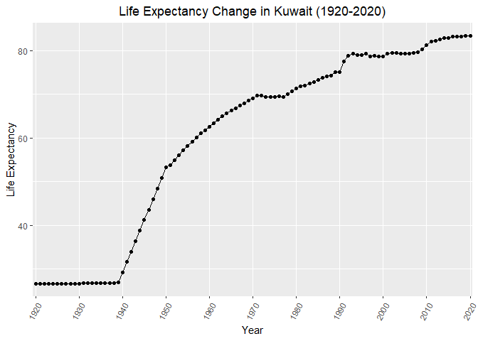
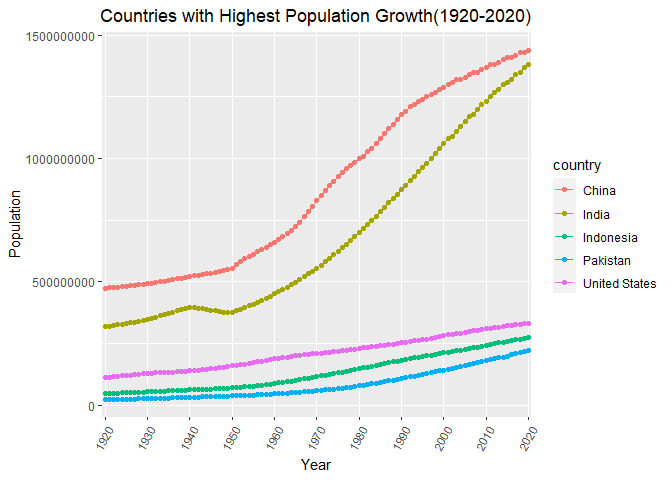
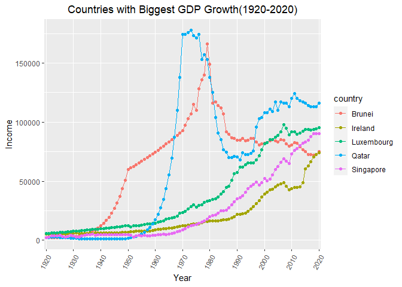
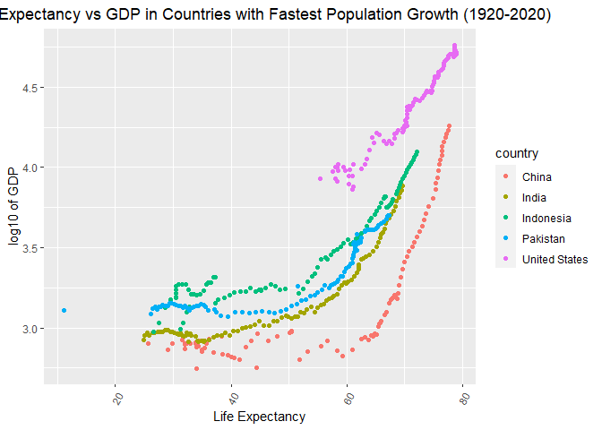

## Instructions
Answer the following questions and complete the exercises in RMarkdown. Please embed all of your code and push your final work to your repository. Your code should be organized, clean, and run free from errors. Be sure to **add your name** to the author header above. You may use any resources to answer these questions (including each other), but you may not post questions to Open Stacks or external help sites. There are 10 total questions.  

Make sure to use the formatting conventions of RMarkdown to make your report neat and clean! Your plots should use consistent aesthetics throughout. Feel free to be creative- there are many possible solutions to these questions!  

This exam is due by **12:00p on Tuesday, February 23**.  

## Load the libraries

```r
library(tidyverse)
```

```
## -- Attaching packages --------------------------------------- tidyverse 1.3.0 --
```

```
## √ ggplot2 3.3.3     √ purrr   0.3.4
## √ tibble  3.0.6     √ dplyr   1.0.4
## √ tidyr   1.1.2     √ stringr 1.4.0
## √ readr   1.4.0     √ forcats 0.5.1
```

```
## -- Conflicts ------------------------------------------ tidyverse_conflicts() --
## x dplyr::filter() masks stats::filter()
## x dplyr::lag()    masks stats::lag()
```

```r
library(janitor)
```

```
## 
## Attaching package: 'janitor'
```

```
## The following objects are masked from 'package:stats':
## 
##     chisq.test, fisher.test
```

```r
library(here)
```

```
## here() starts at D:/TA files/Winter2021 BIS15L/students_rep/BIS15W2021_jliu
```

```r
options(scipen=999) #disables scientific notation when printing
```

## Gapminder
For this assignment, we are going to use data from  [gapminder](https://www.gapminder.org/). Gapminder includes information about economics, population, social issues, and life expectancy from countries all over the world. We will use three data sets, so please load all three.  

One thing to note is that the data include years beyond 2021. These are projections based on modeling done by the gapminder organization. Start by importing the data.

```r
population <- readr::read_csv("data/population_total.csv")
```

```
## 
## -- Column specification --------------------------------------------------------
## cols(
##   .default = col_double(),
##   country = col_character()
## )
## i Use `spec()` for the full column specifications.
```

```r
population
```

```
## # A tibble: 195 x 302
##    country `1800` `1801` `1802` `1803` `1804` `1805` `1806` `1807` `1808` `1809`
##    <chr>    <dbl>  <dbl>  <dbl>  <dbl>  <dbl>  <dbl>  <dbl>  <dbl>  <dbl>  <dbl>
##  1 Afghan~ 3.28e6 3.28e6 3.28e6 3.28e6 3.28e6 3.28e6 3.28e6 3.28e6 3.28e6 3.28e6
##  2 Albania 4.00e5 4.02e5 4.04e5 4.05e5 4.07e5 4.09e5 4.11e5 4.13e5 4.14e5 4.16e5
##  3 Algeria 2.50e6 2.51e6 2.52e6 2.53e6 2.54e6 2.55e6 2.56e6 2.56e6 2.57e6 2.58e6
##  4 Andorra 2.65e3 2.65e3 2.65e3 2.65e3 2.65e3 2.65e3 2.65e3 2.65e3 2.65e3 2.65e3
##  5 Angola  1.57e6 1.57e6 1.57e6 1.57e6 1.57e6 1.57e6 1.57e6 1.57e6 1.57e6 1.57e6
##  6 Antigu~ 3.70e4 3.70e4 3.70e4 3.70e4 3.70e4 3.70e4 3.70e4 3.70e4 3.70e4 3.70e4
##  7 Argent~ 5.34e5 5.20e5 5.06e5 4.92e5 4.79e5 4.66e5 4.53e5 4.41e5 4.29e5 4.17e5
##  8 Armenia 4.13e5 4.13e5 4.13e5 4.13e5 4.13e5 4.13e5 4.13e5 4.13e5 4.13e5 4.13e5
##  9 Austra~ 2.00e5 2.05e5 2.11e5 2.16e5 2.22e5 2.27e5 2.33e5 2.39e5 2.46e5 2.52e5
## 10 Austria 3.00e6 3.02e6 3.04e6 3.05e6 3.07e6 3.09e6 3.11e6 3.12e6 3.14e6 3.16e6
## # ... with 185 more rows, and 291 more variables: 1810 <dbl>, 1811 <dbl>,
## #   1812 <dbl>, 1813 <dbl>, 1814 <dbl>, 1815 <dbl>, 1816 <dbl>, 1817 <dbl>,
## #   1818 <dbl>, 1819 <dbl>, 1820 <dbl>, 1821 <dbl>, 1822 <dbl>, 1823 <dbl>,
## #   1824 <dbl>, 1825 <dbl>, 1826 <dbl>, 1827 <dbl>, 1828 <dbl>, 1829 <dbl>,
## #   1830 <dbl>, 1831 <dbl>, 1832 <dbl>, 1833 <dbl>, 1834 <dbl>, 1835 <dbl>,
## #   1836 <dbl>, 1837 <dbl>, 1838 <dbl>, 1839 <dbl>, 1840 <dbl>, 1841 <dbl>,
## #   1842 <dbl>, 1843 <dbl>, 1844 <dbl>, 1845 <dbl>, 1846 <dbl>, 1847 <dbl>,
## #   1848 <dbl>, 1849 <dbl>, 1850 <dbl>, 1851 <dbl>, 1852 <dbl>, 1853 <dbl>,
## #   1854 <dbl>, 1855 <dbl>, 1856 <dbl>, 1857 <dbl>, 1858 <dbl>, 1859 <dbl>,
## #   1860 <dbl>, 1861 <dbl>, 1862 <dbl>, 1863 <dbl>, 1864 <dbl>, 1865 <dbl>,
## #   1866 <dbl>, 1867 <dbl>, 1868 <dbl>, 1869 <dbl>, 1870 <dbl>, 1871 <dbl>,
## #   1872 <dbl>, 1873 <dbl>, 1874 <dbl>, 1875 <dbl>, 1876 <dbl>, 1877 <dbl>,
## #   1878 <dbl>, 1879 <dbl>, 1880 <dbl>, 1881 <dbl>, 1882 <dbl>, 1883 <dbl>,
## #   1884 <dbl>, 1885 <dbl>, 1886 <dbl>, 1887 <dbl>, 1888 <dbl>, 1889 <dbl>,
## #   1890 <dbl>, 1891 <dbl>, 1892 <dbl>, 1893 <dbl>, 1894 <dbl>, 1895 <dbl>,
## #   1896 <dbl>, 1897 <dbl>, 1898 <dbl>, 1899 <dbl>, 1900 <dbl>, 1901 <dbl>,
## #   1902 <dbl>, 1903 <dbl>, 1904 <dbl>, 1905 <dbl>, 1906 <dbl>, 1907 <dbl>,
## #   1908 <dbl>, 1909 <dbl>, ...
```


```r
income <- readr::read_csv("data/income_per_person_gdppercapita_ppp_inflation_adjusted.csv")
```

```
## 
## -- Column specification --------------------------------------------------------
## cols(
##   .default = col_double(),
##   country = col_character()
## )
## i Use `spec()` for the full column specifications.
```

```r
income
```

```
## # A tibble: 193 x 242
##    country `1800` `1801` `1802` `1803` `1804` `1805` `1806` `1807` `1808` `1809`
##    <chr>    <dbl>  <dbl>  <dbl>  <dbl>  <dbl>  <dbl>  <dbl>  <dbl>  <dbl>  <dbl>
##  1 Afghan~    603    603    603    603    603    603    603    603    603    603
##  2 Albania    667    667    667    667    667    668    668    668    668    668
##  3 Algeria    715    716    717    718    719    720    721    722    723    724
##  4 Andorra   1200   1200   1200   1200   1210   1210   1210   1210   1220   1220
##  5 Angola     618    620    623    626    628    631    634    637    640    642
##  6 Antigu~    757    757    757    757    757    757    757    758    758    758
##  7 Argent~   1640   1640   1650   1650   1660   1660   1670   1680   1680   1690
##  8 Armenia    514    514    514    514    514    514    514    514    514    514
##  9 Austra~    817    822    826    831    836    841    845    850    855    860
## 10 Austria   1850   1850   1860   1870   1880   1880   1890   1900   1910   1920
## # ... with 183 more rows, and 231 more variables: 1810 <dbl>, 1811 <dbl>,
## #   1812 <dbl>, 1813 <dbl>, 1814 <dbl>, 1815 <dbl>, 1816 <dbl>, 1817 <dbl>,
## #   1818 <dbl>, 1819 <dbl>, 1820 <dbl>, 1821 <dbl>, 1822 <dbl>, 1823 <dbl>,
## #   1824 <dbl>, 1825 <dbl>, 1826 <dbl>, 1827 <dbl>, 1828 <dbl>, 1829 <dbl>,
## #   1830 <dbl>, 1831 <dbl>, 1832 <dbl>, 1833 <dbl>, 1834 <dbl>, 1835 <dbl>,
## #   1836 <dbl>, 1837 <dbl>, 1838 <dbl>, 1839 <dbl>, 1840 <dbl>, 1841 <dbl>,
## #   1842 <dbl>, 1843 <dbl>, 1844 <dbl>, 1845 <dbl>, 1846 <dbl>, 1847 <dbl>,
## #   1848 <dbl>, 1849 <dbl>, 1850 <dbl>, 1851 <dbl>, 1852 <dbl>, 1853 <dbl>,
## #   1854 <dbl>, 1855 <dbl>, 1856 <dbl>, 1857 <dbl>, 1858 <dbl>, 1859 <dbl>,
## #   1860 <dbl>, 1861 <dbl>, 1862 <dbl>, 1863 <dbl>, 1864 <dbl>, 1865 <dbl>,
## #   1866 <dbl>, 1867 <dbl>, 1868 <dbl>, 1869 <dbl>, 1870 <dbl>, 1871 <dbl>,
## #   1872 <dbl>, 1873 <dbl>, 1874 <dbl>, 1875 <dbl>, 1876 <dbl>, 1877 <dbl>,
## #   1878 <dbl>, 1879 <dbl>, 1880 <dbl>, 1881 <dbl>, 1882 <dbl>, 1883 <dbl>,
## #   1884 <dbl>, 1885 <dbl>, 1886 <dbl>, 1887 <dbl>, 1888 <dbl>, 1889 <dbl>,
## #   1890 <dbl>, 1891 <dbl>, 1892 <dbl>, 1893 <dbl>, 1894 <dbl>, 1895 <dbl>,
## #   1896 <dbl>, 1897 <dbl>, 1898 <dbl>, 1899 <dbl>, 1900 <dbl>, 1901 <dbl>,
## #   1902 <dbl>, 1903 <dbl>, 1904 <dbl>, 1905 <dbl>, 1906 <dbl>, 1907 <dbl>,
## #   1908 <dbl>, 1909 <dbl>, ...
```


```r
life_expectancy <- readr::read_csv("data/life_expectancy_years.csv")
```

```
## 
## -- Column specification --------------------------------------------------------
## cols(
##   .default = col_double(),
##   country = col_character()
## )
## i Use `spec()` for the full column specifications.
```

```r
life_expectancy
```

```
## # A tibble: 187 x 302
##    country `1800` `1801` `1802` `1803` `1804` `1805` `1806` `1807` `1808` `1809`
##    <chr>    <dbl>  <dbl>  <dbl>  <dbl>  <dbl>  <dbl>  <dbl>  <dbl>  <dbl>  <dbl>
##  1 Afghan~   28.2   28.2   28.2   28.2   28.2   28.2   28.1   28.1   28.1   28.1
##  2 Albania   35.4   35.4   35.4   35.4   35.4   35.4   35.4   35.4   35.4   35.4
##  3 Algeria   28.8   28.8   28.8   28.8   28.8   28.8   28.8   28.8   28.8   28.8
##  4 Andorra   NA     NA     NA     NA     NA     NA     NA     NA     NA     NA  
##  5 Angola    27     27     27     27     27     27     27     27     27     27  
##  6 Antigu~   33.5   33.5   33.5   33.5   33.5   33.5   33.5   33.5   33.5   33.5
##  7 Argent~   33.2   33.2   33.2   33.2   33.2   33.2   33.2   33.2   33.2   33.2
##  8 Armenia   34     34     34     34     34     34     34     34     34     34  
##  9 Austra~   34     34     34     34     34     34     34     34     34     34  
## 10 Austria   34.4   34.4   34.4   34.4   34.4   34.4   34.4   34.4   34.4   34.4
## # ... with 177 more rows, and 291 more variables: 1810 <dbl>, 1811 <dbl>,
## #   1812 <dbl>, 1813 <dbl>, 1814 <dbl>, 1815 <dbl>, 1816 <dbl>, 1817 <dbl>,
## #   1818 <dbl>, 1819 <dbl>, 1820 <dbl>, 1821 <dbl>, 1822 <dbl>, 1823 <dbl>,
## #   1824 <dbl>, 1825 <dbl>, 1826 <dbl>, 1827 <dbl>, 1828 <dbl>, 1829 <dbl>,
## #   1830 <dbl>, 1831 <dbl>, 1832 <dbl>, 1833 <dbl>, 1834 <dbl>, 1835 <dbl>,
## #   1836 <dbl>, 1837 <dbl>, 1838 <dbl>, 1839 <dbl>, 1840 <dbl>, 1841 <dbl>,
## #   1842 <dbl>, 1843 <dbl>, 1844 <dbl>, 1845 <dbl>, 1846 <dbl>, 1847 <dbl>,
## #   1848 <dbl>, 1849 <dbl>, 1850 <dbl>, 1851 <dbl>, 1852 <dbl>, 1853 <dbl>,
## #   1854 <dbl>, 1855 <dbl>, 1856 <dbl>, 1857 <dbl>, 1858 <dbl>, 1859 <dbl>,
## #   1860 <dbl>, 1861 <dbl>, 1862 <dbl>, 1863 <dbl>, 1864 <dbl>, 1865 <dbl>,
## #   1866 <dbl>, 1867 <dbl>, 1868 <dbl>, 1869 <dbl>, 1870 <dbl>, 1871 <dbl>,
## #   1872 <dbl>, 1873 <dbl>, 1874 <dbl>, 1875 <dbl>, 1876 <dbl>, 1877 <dbl>,
## #   1878 <dbl>, 1879 <dbl>, 1880 <dbl>, 1881 <dbl>, 1882 <dbl>, 1883 <dbl>,
## #   1884 <dbl>, 1885 <dbl>, 1886 <dbl>, 1887 <dbl>, 1888 <dbl>, 1889 <dbl>,
## #   1890 <dbl>, 1891 <dbl>, 1892 <dbl>, 1893 <dbl>, 1894 <dbl>, 1895 <dbl>,
## #   1896 <dbl>, 1897 <dbl>, 1898 <dbl>, 1899 <dbl>, 1900 <dbl>, 1901 <dbl>,
## #   1902 <dbl>, 1903 <dbl>, 1904 <dbl>, 1905 <dbl>, 1906 <dbl>, 1907 <dbl>,
## #   1908 <dbl>, 1909 <dbl>, ...
```

1. (3 points) Once you have an idea of the structure of the data, please make each data set tidy and store them as new objects. You will need both the original and tidy data!

```r
str(population)
```

```
## spec_tbl_df [195 x 302] (S3: spec_tbl_df/tbl_df/tbl/data.frame)
##  $ country: chr [1:195] "Afghanistan" "Albania" "Algeria" "Andorra" ...
##  $ 1800   : num [1:195] 3280000 400000 2500000 2650 1570000 37000 534000 413000 200000 3000000 ...
##  $ 1801   : num [1:195] 3280000 402000 2510000 2650 1570000 37000 520000 413000 205000 3020000 ...
##  $ 1802   : num [1:195] 3280000 404000 2520000 2650 1570000 37000 506000 413000 211000 3040000 ...
##  $ 1803   : num [1:195] 3280000 405000 2530000 2650 1570000 37000 492000 413000 216000 3050000 ...
##  $ 1804   : num [1:195] 3280000 407000 2540000 2650 1570000 37000 479000 413000 222000 3070000 ...
##  $ 1805   : num [1:195] 3280000 409000 2550000 2650 1570000 37000 466000 413000 227000 3090000 ...
##  $ 1806   : num [1:195] 3280000 411000 2560000 2650 1570000 37000 453000 413000 233000 3110000 ...
##  $ 1807   : num [1:195] 3280000 413000 2560000 2650 1570000 37000 441000 413000 239000 3120000 ...
##  $ 1808   : num [1:195] 3280000 414000 2570000 2650 1570000 37000 429000 413000 246000 3140000 ...
##  $ 1809   : num [1:195] 3280000 416000 2580000 2650 1570000 37000 417000 413000 252000 3160000 ...
##  $ 1810   : num [1:195] 3280000 418000 2590000 2650 1570000 37000 420000 413000 259000 3180000 ...
##  $ 1811   : num [1:195] 3280000 420000 2600000 2650 1570000 37000 422000 413000 265000 3200000 ...
##  $ 1812   : num [1:195] 3280000 422000 2610000 2650 1570000 37000 429000 413000 272000 3220000 ...
##  $ 1813   : num [1:195] 3280000 424000 2620000 2650 1570000 37000 441000 413000 279000 3240000 ...
##  $ 1814   : num [1:195] 3280000 426000 2630000 2650 1570000 37000 453000 413000 287000 3250000 ...
##  $ 1815   : num [1:195] 3280000 427000 2640000 2650 1570000 37000 466000 413000 294000 3270000 ...
##  $ 1816   : num [1:195] 3280000 429000 2650000 2650 1570000 37000 479000 413000 302000 3290000 ...
##  $ 1817   : num [1:195] 3280000 431000 2660000 2650 1570000 37000 492000 413000 309000 3310000 ...
##  $ 1818   : num [1:195] 3280000 433000 2670000 2650 1570000 37000 506000 413000 318000 3330000 ...
##  $ 1819   : num [1:195] 3280000 435000 2680000 2660 1570000 37000 519000 414000 324000 3350000 ...
##  $ 1820   : num [1:195] 3290000 437000 2690000 2670 1580000 37000 531000 416000 329000 3370000 ...
##  $ 1821   : num [1:195] 3300000 439000 2690000 2680 1590000 37000 542000 418000 332000 3390000 ...
##  $ 1822   : num [1:195] 3310000 441000 2700000 2690 1610000 37000 553000 421000 333000 3400000 ...
##  $ 1823   : num [1:195] 3320000 443000 2700000 2710 1640000 37000 562000 425000 333000 3420000 ...
##  $ 1824   : num [1:195] 3340000 445000 2710000 2730 1660000 37000 572000 429000 332000 3440000 ...
##  $ 1825   : num [1:195] 3350000 447000 2710000 2750 1690000 37000 582000 433000 332000 3450000 ...
##  $ 1826   : num [1:195] 3370000 449000 2720000 2770 1710000 37000 592000 437000 332000 3470000 ...
##  $ 1827   : num [1:195] 3380000 451000 2720000 2790 1740000 37000 602000 441000 331000 3490000 ...
##  $ 1828   : num [1:195] 3400000 453000 2730000 2810 1760000 37000 613000 445000 331000 3500000 ...
##  $ 1829   : num [1:195] 3410000 455000 2730000 2830 1790000 37000 624000 449000 332000 3520000 ...
##  $ 1830   : num [1:195] 3430000 457000 2740000 2850 1810000 37000 635000 453000 335000 3540000 ...
##  $ 1831   : num [1:195] 3450000 459000 2740000 2870 1840000 37000 647000 457000 340000 3560000 ...
##  $ 1832   : num [1:195] 3460000 461000 2750000 2890 1870000 37000 659000 461000 347000 3570000 ...
##  $ 1833   : num [1:195] 3480000 463000 2750000 2910 1900000 37000 672000 465000 355000 3590000 ...
##  $ 1834   : num [1:195] 3490000 465000 2760000 2930 1920000 37000 685000 470000 364000 3610000 ...
##  $ 1835   : num [1:195] 3510000 467000 2760000 2950 1950000 37000 698000 474000 373000 3630000 ...
##  $ 1836   : num [1:195] 3520000 470000 2770000 2970 1980000 37000 712000 478000 382000 3640000 ...
##  $ 1837   : num [1:195] 3540000 472000 2770000 2990 2010000 37000 725000 483000 391000 3660000 ...
##  $ 1838   : num [1:195] 3550000 474000 2780000 3010 2040000 37000 739000 487000 400000 3680000 ...
##  $ 1839   : num [1:195] 3570000 476000 2780000 3030 2070000 37000 756000 492000 411000 3700000 ...
##  $ 1840   : num [1:195] 3590000 478000 2790000 3060 2100000 37000 776000 496000 424000 3720000 ...
##  $ 1841   : num [1:195] 3600000 480000 2790000 3080 2130000 37000 800000 501000 437000 3740000 ...
##  $ 1842   : num [1:195] 3620000 482000 2800000 3100 2160000 37000 826000 505000 452000 3760000 ...
##  $ 1843   : num [1:195] 3630000 485000 2800000 3120 2190000 37000 857000 510000 469000 3780000 ...
##  $ 1844   : num [1:195] 3650000 487000 2810000 3140 2230000 37000 888000 515000 487000 3810000 ...
##  $ 1845   : num [1:195] 3670000 489000 2810000 3170 2260000 37000 920000 519000 505000 3830000 ...
##  $ 1846   : num [1:195] 3680000 491000 2820000 3190 2290000 37000 954000 524000 524000 3850000 ...
##  $ 1847   : num [1:195] 3700000 493000 2820000 3210 2330000 37000 989000 529000 543000 3880000 ...
##  $ 1848   : num [1:195] 3720000 496000 2830000 3230 2360000 37000 1030000 534000 563000 3900000 ...
##  $ 1849   : num [1:195] 3730000 498000 2840000 3260 2390000 37000 1060000 539000 589000 3930000 ...
##  $ 1850   : num [1:195] 3750000 501000 2850000 3280 2420000 37000 1090000 544000 623000 3950000 ...
##  $ 1851   : num [1:195] 3770000 505000 2870000 3300 2450000 37000 1120000 549000 663000 3980000 ...
##  $ 1852   : num [1:195] 3790000 510000 2900000 3320 2470000 37000 1140000 553000 712000 4010000 ...
##  $ 1853   : num [1:195] 3810000 515000 2920000 3350 2490000 37000 1160000 558000 770000 4030000 ...
##  $ 1854   : num [1:195] 3830000 520000 2950000 3370 2510000 37000 1180000 563000 832000 4060000 ...
##  $ 1855   : num [1:195] 3840000 525000 2980000 3390 2530000 37000 1200000 568000 900000 4090000 ...
##  $ 1856   : num [1:195] 3860000 530000 3010000 3420 2550000 37000 1220000 574000 973000 4120000 ...
##  $ 1857   : num [1:195] 3880000 535000 3040000 3440 2570000 37000 1240000 579000 1050000 4150000 ...
##  $ 1858   : num [1:195] 3900000 540000 3070000 3460 2600000 36900 1260000 584000 1140000 4180000 ...
##  $ 1859   : num [1:195] 3920000 545000 3100000 3490 2620000 36900 1290000 589000 1220000 4210000 ...
##  $ 1860   : num [1:195] 3940000 551000 3130000 3510 2640000 36800 1320000 594000 1290000 4230000 ...
##  $ 1861   : num [1:195] 3960000 556000 3170000 3540 2660000 36700 1350000 600000 1350000 4260000 ...
##  $ 1862   : num [1:195] 3980000 561000 3200000 3560 2680000 36500 1390000 605000 1400000 4290000 ...
##  $ 1863   : num [1:195] 4000000 567000 3230000 3590 2710000 36300 1440000 610000 1440000 4320000 ...
##  $ 1864   : num [1:195] 4020000 572000 3260000 3610 2730000 36100 1480000 616000 1490000 4350000 ...
##  $ 1865   : num [1:195] 4040000 578000 3290000 3640 2750000 35900 1530000 621000 1530000 4380000 ...
##  $ 1866   : num [1:195] 4060000 584000 3330000 3660 2780000 35700 1580000 627000 1580000 4410000 ...
##  $ 1867   : num [1:195] 4080000 589000 3360000 3690 2800000 35500 1630000 633000 1620000 4430000 ...
##  $ 1868   : num [1:195] 4100000 595000 3390000 3710 2820000 35300 1680000 638000 1670000 4460000 ...
##  $ 1869   : num [1:195] 4120000 601000 3430000 3740 2840000 35100 1740000 644000 1720000 4490000 ...
##  $ 1870   : num [1:195] 4140000 606000 3460000 3760 2870000 35000 1790000 650000 1760000 4530000 ...
##  $ 1871   : num [1:195] 4160000 612000 3500000 3790 2890000 34900 1850000 655000 1800000 4560000 ...
##  $ 1872   : num [1:195] 4180000 618000 3530000 3820 2910000 34900 1910000 661000 1840000 4600000 ...
##  $ 1873   : num [1:195] 4210000 624000 3570000 3840 2930000 34900 1970000 667000 1880000 4640000 ...
##  $ 1874   : num [1:195] 4230000 630000 3600000 3870 2940000 34900 2030000 673000 1920000 4690000 ...
##  $ 1875   : num [1:195] 4250000 636000 3640000 3900 2960000 34800 2100000 679000 1960000 4730000 ...
##  $ 1876   : num [1:195] 4270000 642000 3670000 3920 2980000 34800 2170000 685000 2010000 4770000 ...
##  $ 1877   : num [1:195] 4290000 648000 3710000 3950 3000000 34800 2240000 691000 2050000 4810000 ...
##  $ 1878   : num [1:195] 4310000 655000 3750000 3980 3020000 34800 2310000 698000 2090000 4860000 ...
##  $ 1879   : num [1:195] 4330000 661000 3790000 4010 3040000 34900 2380000 704000 2140000 4900000 ...
##  $ 1880   : num [1:195] 4350000 667000 3820000 4030 3060000 34900 2460000 710000 2200000 4940000 ...
##  $ 1881   : num [1:195] 4380000 674000 3860000 4060 3080000 35000 2540000 716000 2270000 4990000 ...
##  $ 1882   : num [1:195] 4400000 680000 3900000 4090 3100000 35200 2620000 723000 2340000 5030000 ...
##  $ 1883   : num [1:195] 4420000 687000 3940000 4120 3120000 35400 2700000 729000 2420000 5080000 ...
##  $ 1884   : num [1:195] 4440000 693000 3980000 4150 3140000 35600 2790000 736000 2510000 5120000 ...
##  $ 1885   : num [1:195] 4460000 700000 4020000 4170 3160000 35800 2880000 742000 2600000 5170000 ...
##  $ 1886   : num [1:195] 4490000 707000 4060000 4200 3180000 36000 2970000 749000 2690000 5210000 ...
##  $ 1887   : num [1:195] 4510000 714000 4100000 4230 3200000 36200 3060000 756000 2780000 5260000 ...
##  $ 1888   : num [1:195] 4530000 720000 4140000 4260 3220000 36300 3160000 763000 2880000 5300000 ...
##  $ 1889   : num [1:195] 4550000 727000 4180000 4290 3230000 36500 3260000 769000 2970000 5350000 ...
##  $ 1890   : num [1:195] 4580000 735000 4220000 4320 3240000 36500 3370000 776000 3050000 5400000 ...
##  $ 1891   : num [1:195] 4600000 742000 4260000 4350 3240000 36400 3480000 783000 3130000 5460000 ...
##  $ 1892   : num [1:195] 4620000 749000 4300000 4380 3240000 36300 3600000 790000 3200000 5510000 ...
##  $ 1893   : num [1:195] 4650000 757000 4340000 4410 3230000 36100 3720000 797000 3250000 5570000 ...
##  $ 1894   : num [1:195] 4670000 764000 4390000 4440 3210000 35900 3840000 804000 3310000 5620000 ...
##  $ 1895   : num [1:195] 4690000 772000 4430000 4470 3200000 35700 3970000 812000 3380000 5680000 ...
##  $ 1896   : num [1:195] 4710000 780000 4470000 4500 3190000 35500 4100000 819000 3440000 5740000 ...
##  $ 1897   : num [1:195] 4740000 788000 4510000 4540 3180000 35300 4240000 826000 3500000 5800000 ...
##   [list output truncated]
##  - attr(*, "spec")=
##   .. cols(
##   ..   country = col_character(),
##   ..   `1800` = col_double(),
##   ..   `1801` = col_double(),
##   ..   `1802` = col_double(),
##   ..   `1803` = col_double(),
##   ..   `1804` = col_double(),
##   ..   `1805` = col_double(),
##   ..   `1806` = col_double(),
##   ..   `1807` = col_double(),
##   ..   `1808` = col_double(),
##   ..   `1809` = col_double(),
##   ..   `1810` = col_double(),
##   ..   `1811` = col_double(),
##   ..   `1812` = col_double(),
##   ..   `1813` = col_double(),
##   ..   `1814` = col_double(),
##   ..   `1815` = col_double(),
##   ..   `1816` = col_double(),
##   ..   `1817` = col_double(),
##   ..   `1818` = col_double(),
##   ..   `1819` = col_double(),
##   ..   `1820` = col_double(),
##   ..   `1821` = col_double(),
##   ..   `1822` = col_double(),
##   ..   `1823` = col_double(),
##   ..   `1824` = col_double(),
##   ..   `1825` = col_double(),
##   ..   `1826` = col_double(),
##   ..   `1827` = col_double(),
##   ..   `1828` = col_double(),
##   ..   `1829` = col_double(),
##   ..   `1830` = col_double(),
##   ..   `1831` = col_double(),
##   ..   `1832` = col_double(),
##   ..   `1833` = col_double(),
##   ..   `1834` = col_double(),
##   ..   `1835` = col_double(),
##   ..   `1836` = col_double(),
##   ..   `1837` = col_double(),
##   ..   `1838` = col_double(),
##   ..   `1839` = col_double(),
##   ..   `1840` = col_double(),
##   ..   `1841` = col_double(),
##   ..   `1842` = col_double(),
##   ..   `1843` = col_double(),
##   ..   `1844` = col_double(),
##   ..   `1845` = col_double(),
##   ..   `1846` = col_double(),
##   ..   `1847` = col_double(),
##   ..   `1848` = col_double(),
##   ..   `1849` = col_double(),
##   ..   `1850` = col_double(),
##   ..   `1851` = col_double(),
##   ..   `1852` = col_double(),
##   ..   `1853` = col_double(),
##   ..   `1854` = col_double(),
##   ..   `1855` = col_double(),
##   ..   `1856` = col_double(),
##   ..   `1857` = col_double(),
##   ..   `1858` = col_double(),
##   ..   `1859` = col_double(),
##   ..   `1860` = col_double(),
##   ..   `1861` = col_double(),
##   ..   `1862` = col_double(),
##   ..   `1863` = col_double(),
##   ..   `1864` = col_double(),
##   ..   `1865` = col_double(),
##   ..   `1866` = col_double(),
##   ..   `1867` = col_double(),
##   ..   `1868` = col_double(),
##   ..   `1869` = col_double(),
##   ..   `1870` = col_double(),
##   ..   `1871` = col_double(),
##   ..   `1872` = col_double(),
##   ..   `1873` = col_double(),
##   ..   `1874` = col_double(),
##   ..   `1875` = col_double(),
##   ..   `1876` = col_double(),
##   ..   `1877` = col_double(),
##   ..   `1878` = col_double(),
##   ..   `1879` = col_double(),
##   ..   `1880` = col_double(),
##   ..   `1881` = col_double(),
##   ..   `1882` = col_double(),
##   ..   `1883` = col_double(),
##   ..   `1884` = col_double(),
##   ..   `1885` = col_double(),
##   ..   `1886` = col_double(),
##   ..   `1887` = col_double(),
##   ..   `1888` = col_double(),
##   ..   `1889` = col_double(),
##   ..   `1890` = col_double(),
##   ..   `1891` = col_double(),
##   ..   `1892` = col_double(),
##   ..   `1893` = col_double(),
##   ..   `1894` = col_double(),
##   ..   `1895` = col_double(),
##   ..   `1896` = col_double(),
##   ..   `1897` = col_double(),
##   ..   `1898` = col_double(),
##   ..   `1899` = col_double(),
##   ..   `1900` = col_double(),
##   ..   `1901` = col_double(),
##   ..   `1902` = col_double(),
##   ..   `1903` = col_double(),
##   ..   `1904` = col_double(),
##   ..   `1905` = col_double(),
##   ..   `1906` = col_double(),
##   ..   `1907` = col_double(),
##   ..   `1908` = col_double(),
##   ..   `1909` = col_double(),
##   ..   `1910` = col_double(),
##   ..   `1911` = col_double(),
##   ..   `1912` = col_double(),
##   ..   `1913` = col_double(),
##   ..   `1914` = col_double(),
##   ..   `1915` = col_double(),
##   ..   `1916` = col_double(),
##   ..   `1917` = col_double(),
##   ..   `1918` = col_double(),
##   ..   `1919` = col_double(),
##   ..   `1920` = col_double(),
##   ..   `1921` = col_double(),
##   ..   `1922` = col_double(),
##   ..   `1923` = col_double(),
##   ..   `1924` = col_double(),
##   ..   `1925` = col_double(),
##   ..   `1926` = col_double(),
##   ..   `1927` = col_double(),
##   ..   `1928` = col_double(),
##   ..   `1929` = col_double(),
##   ..   `1930` = col_double(),
##   ..   `1931` = col_double(),
##   ..   `1932` = col_double(),
##   ..   `1933` = col_double(),
##   ..   `1934` = col_double(),
##   ..   `1935` = col_double(),
##   ..   `1936` = col_double(),
##   ..   `1937` = col_double(),
##   ..   `1938` = col_double(),
##   ..   `1939` = col_double(),
##   ..   `1940` = col_double(),
##   ..   `1941` = col_double(),
##   ..   `1942` = col_double(),
##   ..   `1943` = col_double(),
##   ..   `1944` = col_double(),
##   ..   `1945` = col_double(),
##   ..   `1946` = col_double(),
##   ..   `1947` = col_double(),
##   ..   `1948` = col_double(),
##   ..   `1949` = col_double(),
##   ..   `1950` = col_double(),
##   ..   `1951` = col_double(),
##   ..   `1952` = col_double(),
##   ..   `1953` = col_double(),
##   ..   `1954` = col_double(),
##   ..   `1955` = col_double(),
##   ..   `1956` = col_double(),
##   ..   `1957` = col_double(),
##   ..   `1958` = col_double(),
##   ..   `1959` = col_double(),
##   ..   `1960` = col_double(),
##   ..   `1961` = col_double(),
##   ..   `1962` = col_double(),
##   ..   `1963` = col_double(),
##   ..   `1964` = col_double(),
##   ..   `1965` = col_double(),
##   ..   `1966` = col_double(),
##   ..   `1967` = col_double(),
##   ..   `1968` = col_double(),
##   ..   `1969` = col_double(),
##   ..   `1970` = col_double(),
##   ..   `1971` = col_double(),
##   ..   `1972` = col_double(),
##   ..   `1973` = col_double(),
##   ..   `1974` = col_double(),
##   ..   `1975` = col_double(),
##   ..   `1976` = col_double(),
##   ..   `1977` = col_double(),
##   ..   `1978` = col_double(),
##   ..   `1979` = col_double(),
##   ..   `1980` = col_double(),
##   ..   `1981` = col_double(),
##   ..   `1982` = col_double(),
##   ..   `1983` = col_double(),
##   ..   `1984` = col_double(),
##   ..   `1985` = col_double(),
##   ..   `1986` = col_double(),
##   ..   `1987` = col_double(),
##   ..   `1988` = col_double(),
##   ..   `1989` = col_double(),
##   ..   `1990` = col_double(),
##   ..   `1991` = col_double(),
##   ..   `1992` = col_double(),
##   ..   `1993` = col_double(),
##   ..   `1994` = col_double(),
##   ..   `1995` = col_double(),
##   ..   `1996` = col_double(),
##   ..   `1997` = col_double(),
##   ..   `1998` = col_double(),
##   ..   `1999` = col_double(),
##   ..   `2000` = col_double(),
##   ..   `2001` = col_double(),
##   ..   `2002` = col_double(),
##   ..   `2003` = col_double(),
##   ..   `2004` = col_double(),
##   ..   `2005` = col_double(),
##   ..   `2006` = col_double(),
##   ..   `2007` = col_double(),
##   ..   `2008` = col_double(),
##   ..   `2009` = col_double(),
##   ..   `2010` = col_double(),
##   ..   `2011` = col_double(),
##   ..   `2012` = col_double(),
##   ..   `2013` = col_double(),
##   ..   `2014` = col_double(),
##   ..   `2015` = col_double(),
##   ..   `2016` = col_double(),
##   ..   `2017` = col_double(),
##   ..   `2018` = col_double(),
##   ..   `2019` = col_double(),
##   ..   `2020` = col_double(),
##   ..   `2021` = col_double(),
##   ..   `2022` = col_double(),
##   ..   `2023` = col_double(),
##   ..   `2024` = col_double(),
##   ..   `2025` = col_double(),
##   ..   `2026` = col_double(),
##   ..   `2027` = col_double(),
##   ..   `2028` = col_double(),
##   ..   `2029` = col_double(),
##   ..   `2030` = col_double(),
##   ..   `2031` = col_double(),
##   ..   `2032` = col_double(),
##   ..   `2033` = col_double(),
##   ..   `2034` = col_double(),
##   ..   `2035` = col_double(),
##   ..   `2036` = col_double(),
##   ..   `2037` = col_double(),
##   ..   `2038` = col_double(),
##   ..   `2039` = col_double(),
##   ..   `2040` = col_double(),
##   ..   `2041` = col_double(),
##   ..   `2042` = col_double(),
##   ..   `2043` = col_double(),
##   ..   `2044` = col_double(),
##   ..   `2045` = col_double(),
##   ..   `2046` = col_double(),
##   ..   `2047` = col_double(),
##   ..   `2048` = col_double(),
##   ..   `2049` = col_double(),
##   ..   `2050` = col_double(),
##   ..   `2051` = col_double(),
##   ..   `2052` = col_double(),
##   ..   `2053` = col_double(),
##   ..   `2054` = col_double(),
##   ..   `2055` = col_double(),
##   ..   `2056` = col_double(),
##   ..   `2057` = col_double(),
##   ..   `2058` = col_double(),
##   ..   `2059` = col_double(),
##   ..   `2060` = col_double(),
##   ..   `2061` = col_double(),
##   ..   `2062` = col_double(),
##   ..   `2063` = col_double(),
##   ..   `2064` = col_double(),
##   ..   `2065` = col_double(),
##   ..   `2066` = col_double(),
##   ..   `2067` = col_double(),
##   ..   `2068` = col_double(),
##   ..   `2069` = col_double(),
##   ..   `2070` = col_double(),
##   ..   `2071` = col_double(),
##   ..   `2072` = col_double(),
##   ..   `2073` = col_double(),
##   ..   `2074` = col_double(),
##   ..   `2075` = col_double(),
##   ..   `2076` = col_double(),
##   ..   `2077` = col_double(),
##   ..   `2078` = col_double(),
##   ..   `2079` = col_double(),
##   ..   `2080` = col_double(),
##   ..   `2081` = col_double(),
##   ..   `2082` = col_double(),
##   ..   `2083` = col_double(),
##   ..   `2084` = col_double(),
##   ..   `2085` = col_double(),
##   ..   `2086` = col_double(),
##   ..   `2087` = col_double(),
##   ..   `2088` = col_double(),
##   ..   `2089` = col_double(),
##   ..   `2090` = col_double(),
##   ..   `2091` = col_double(),
##   ..   `2092` = col_double(),
##   ..   `2093` = col_double(),
##   ..   `2094` = col_double(),
##   ..   `2095` = col_double(),
##   ..   `2096` = col_double(),
##   ..   `2097` = col_double(),
##   ..   `2098` = col_double(),
##   ..   `2099` = col_double(),
##   ..   `2100` = col_double()
##   .. )
```

```r
pop_tidy <- population %>%
  pivot_longer(-country,
               names_to = "year",
               values_to = "population_n")
pop_tidy
```

```
## # A tibble: 58,695 x 3
##    country     year  population_n
##    <chr>       <chr>        <dbl>
##  1 Afghanistan 1800       3280000
##  2 Afghanistan 1801       3280000
##  3 Afghanistan 1802       3280000
##  4 Afghanistan 1803       3280000
##  5 Afghanistan 1804       3280000
##  6 Afghanistan 1805       3280000
##  7 Afghanistan 1806       3280000
##  8 Afghanistan 1807       3280000
##  9 Afghanistan 1808       3280000
## 10 Afghanistan 1809       3280000
## # ... with 58,685 more rows
```


```r
str(income)
```

```
## spec_tbl_df [193 x 242] (S3: spec_tbl_df/tbl_df/tbl/data.frame)
##  $ country: chr [1:193] "Afghanistan" "Albania" "Algeria" "Andorra" ...
##  $ 1800   : num [1:193] 603 667 715 1200 618 757 1640 514 817 1850 ...
##  $ 1801   : num [1:193] 603 667 716 1200 620 757 1640 514 822 1850 ...
##  $ 1802   : num [1:193] 603 667 717 1200 623 757 1650 514 826 1860 ...
##  $ 1803   : num [1:193] 603 667 718 1200 626 757 1650 514 831 1870 ...
##  $ 1804   : num [1:193] 603 667 719 1210 628 757 1660 514 836 1880 ...
##  $ 1805   : num [1:193] 603 668 720 1210 631 757 1660 514 841 1880 ...
##  $ 1806   : num [1:193] 603 668 721 1210 634 757 1670 514 845 1890 ...
##  $ 1807   : num [1:193] 603 668 722 1210 637 758 1680 514 850 1900 ...
##  $ 1808   : num [1:193] 603 668 723 1220 640 758 1680 514 855 1910 ...
##  $ 1809   : num [1:193] 603 668 724 1220 642 758 1690 514 860 1920 ...
##  $ 1810   : num [1:193] 604 668 725 1220 645 758 1690 514 865 1920 ...
##  $ 1811   : num [1:193] 604 668 726 1220 648 758 1700 515 869 1940 ...
##  $ 1812   : num [1:193] 604 668 727 1220 651 758 1710 515 874 1960 ...
##  $ 1813   : num [1:193] 604 668 728 1230 654 758 1710 515 879 1980 ...
##  $ 1814   : num [1:193] 604 668 729 1230 657 758 1720 515 884 2000 ...
##  $ 1815   : num [1:193] 604 669 730 1230 660 758 1720 515 889 2020 ...
##  $ 1816   : num [1:193] 604 669 731 1230 662 759 1730 515 894 2040 ...
##  $ 1817   : num [1:193] 604 669 732 1240 665 759 1740 515 899 2050 ...
##  $ 1818   : num [1:193] 604 669 733 1240 668 759 1740 515 904 2070 ...
##  $ 1819   : num [1:193] 604 669 734 1240 671 759 1750 515 910 2090 ...
##  $ 1820   : num [1:193] 604 669 735 1240 674 759 1750 515 941 2110 ...
##  $ 1821   : num [1:193] 607 671 743 1260 677 764 1770 517 950 2140 ...
##  $ 1822   : num [1:193] 609 672 751 1270 680 769 1780 519 977 2170 ...
##  $ 1823   : num [1:193] 611 674 759 1290 683 775 1790 521 1010 2200 ...
##  $ 1824   : num [1:193] 613 675 767 1300 686 780 1810 523 1070 2230 ...
##  $ 1825   : num [1:193] 615 677 775 1320 689 785 1820 525 1120 2260 ...
##  $ 1826   : num [1:193] 617 678 784 1330 692 790 1830 527 1140 2300 ...
##  $ 1827   : num [1:193] 619 680 792 1350 695 796 1850 529 1170 2330 ...
##  $ 1828   : num [1:193] 621 681 801 1370 698 801 1860 531 1200 2360 ...
##  $ 1829   : num [1:193] 623 683 810 1380 701 806 1880 533 1270 2390 ...
##  $ 1830   : num [1:193] 625 684 819 1400 704 812 1890 535 1540 2430 ...
##  $ 1831   : num [1:193] 627 686 828 1410 708 817 1910 538 1590 2440 ...
##  $ 1832   : num [1:193] 630 688 837 1430 711 823 1920 540 1630 2460 ...
##  $ 1833   : num [1:193] 632 689 846 1450 714 828 1930 542 1640 2480 ...
##  $ 1834   : num [1:193] 634 691 855 1470 717 834 1950 544 1720 2500 ...
##  $ 1835   : num [1:193] 636 692 864 1480 720 840 1960 546 2080 2520 ...
##  $ 1836   : num [1:193] 638 694 874 1500 723 845 1980 548 2050 2540 ...
##  $ 1837   : num [1:193] 640 695 883 1520 726 851 1990 550 2140 2560 ...
##  $ 1838   : num [1:193] 643 697 893 1540 730 857 2010 552 2120 2590 ...
##  $ 1839   : num [1:193] 645 699 903 1550 733 863 2020 554 1980 2610 ...
##  $ 1840   : num [1:193] 647 700 912 1570 736 868 2040 556 2500 2630 ...
##  $ 1841   : num [1:193] 649 702 922 1590 739 874 2050 559 2130 2650 ...
##  $ 1842   : num [1:193] 651 703 932 1610 743 880 2070 561 1940 2670 ...
##  $ 1843   : num [1:193] 654 705 943 1630 746 886 2090 563 2250 2690 ...
##  $ 1844   : num [1:193] 656 707 953 1650 749 892 2100 565 2560 2720 ...
##  $ 1845   : num [1:193] 658 708 963 1670 752 898 2120 567 2630 2740 ...
##  $ 1846   : num [1:193] 660 710 974 1690 756 904 2130 569 2910 2770 ...
##  $ 1847   : num [1:193] 663 711 984 1710 759 910 2150 572 3370 2790 ...
##  $ 1848   : num [1:193] 665 713 995 1730 762 917 2170 574 3850 2810 ...
##  $ 1849   : num [1:193] 667 715 1010 1750 766 923 2180 576 3810 2840 ...
##  $ 1850   : num [1:193] 669 716 1020 1770 769 929 2200 578 3590 2860 ...
##  $ 1851   : num [1:193] 672 718 1030 1790 773 935 2220 581 4260 2880 ...
##  $ 1852   : num [1:193] 674 720 1040 1810 776 942 2230 583 5000 2900 ...
##  $ 1853   : num [1:193] 676 721 1050 1830 779 948 2250 585 5470 2930 ...
##  $ 1854   : num [1:193] 678 723 1060 1860 783 954 2270 587 4790 2950 ...
##  $ 1855   : num [1:193] 681 724 1070 1880 786 961 2290 590 4550 2970 ...
##  $ 1856   : num [1:193] 683 726 1090 1900 790 967 2310 592 5550 2990 ...
##  $ 1857   : num [1:193] 685 728 1100 1920 793 974 2320 594 4890 3010 ...
##  $ 1858   : num [1:193] 688 729 1110 1950 797 980 2340 596 4170 3040 ...
##  $ 1859   : num [1:193] 690 731 1120 1970 800 987 2360 599 5390 3060 ...
##  $ 1860   : num [1:193] 692 733 1130 1990 804 994 2380 601 5260 3080 ...
##  $ 1861   : num [1:193] 695 738 1150 2020 807 1000 2400 603 5180 3100 ...
##  $ 1862   : num [1:193] 697 745 1160 2040 811 1010 2420 606 4980 3110 ...
##  $ 1863   : num [1:193] 699 751 1170 2060 814 1010 2440 608 4960 3130 ...
##  $ 1864   : num [1:193] 702 757 1180 2090 818 1020 2460 610 5260 3140 ...
##  $ 1865   : num [1:193] 704 763 1200 2110 822 1030 2480 613 5020 3160 ...
##  $ 1866   : num [1:193] 707 770 1210 2140 825 1040 2500 615 5170 3170 ...
##  $ 1867   : num [1:193] 709 776 1220 2160 829 1040 2520 617 5650 3180 ...
##  $ 1868   : num [1:193] 711 782 1240 2190 832 1050 2540 620 5740 3200 ...
##  $ 1869   : num [1:193] 714 788 1250 2220 836 1060 2560 622 5620 3210 ...
##  $ 1870   : num [1:193] 716 795 1260 2240 840 1060 2580 625 5950 3230 ...
##  $ 1871   : num [1:193] 719 807 1280 2270 844 1070 2630 627 5990 3430 ...
##  $ 1872   : num [1:193] 721 819 1290 2300 847 1080 2690 629 6460 3430 ...
##  $ 1873   : num [1:193] 724 831 1310 2320 851 1090 2750 632 6950 3320 ...
##  $ 1874   : num [1:193] 726 843 1320 2350 855 1090 2810 634 6970 3440 ...
##  $ 1875   : num [1:193] 729 855 1330 2380 858 1100 2870 637 7520 3420 ...
##  $ 1876   : num [1:193] 731 868 1350 2410 862 1110 2880 639 7280 3470 ...
##  $ 1877   : num [1:193] 734 881 1360 2440 866 1110 3110 642 7330 3560 ...
##  $ 1878   : num [1:193] 736 894 1380 2460 870 1120 2890 644 7770 3640 ...
##  $ 1879   : num [1:193] 739 907 1390 2490 874 1130 2940 647 7640 3590 ...
##  $ 1880   : num [1:193] 741 920 1410 2520 878 1140 2820 649 7790 3600 ...
##  $ 1881   : num [1:193] 758 934 1420 2550 881 1150 2800 652 8090 3720 ...
##  $ 1882   : num [1:193] 774 947 1440 2580 885 1150 3430 654 7380 3710 ...
##  $ 1883   : num [1:193] 791 961 1450 2610 889 1160 3720 657 8130 3830 ...
##  $ 1884   : num [1:193] 807 976 1470 2650 893 1170 3840 659 7820 3900 ...
##  $ 1885   : num [1:193] 824 990 1490 2680 897 1180 4300 662 8040 3840 ...
##  $ 1886   : num [1:193] 840 1010 1500 2710 901 1180 4160 635 7870 3930 ...
##  $ 1887   : num [1:193] 858 1020 1520 2740 905 1190 4230 741 8420 4170 ...
##  $ 1888   : num [1:193] 874 1030 1540 2770 909 1200 4650 711 8180 4130 ...
##  $ 1889   : num [1:193] 892 1050 1550 2810 913 1210 4730 660 8620 4050 ...
##  $ 1890   : num [1:193] 909 1070 1570 2840 917 1220 4250 656 8100 4240 ...
##  $ 1891   : num [1:193] 926 1080 1590 2870 921 1220 4000 599 8480 4350 ...
##  $ 1892   : num [1:193] 944 1100 1600 2910 925 1230 4680 655 7260 4400 ...
##  $ 1893   : num [1:193] 961 1110 1620 2940 929 1240 4860 740 6740 4380 ...
##  $ 1894   : num [1:193] 979 1130 1640 2980 933 1250 5480 840 6840 4590 ...
##  $ 1895   : num [1:193] 997 1140 1660 3010 937 1260 5930 776 6340 4660 ...
##  $ 1896   : num [1:193] 1010 1160 1680 3050 941 1270 6300 853 6700 4680 ...
##  $ 1897   : num [1:193] 1030 1170 1690 3080 946 1280 4960 837 6210 4730 ...
##   [list output truncated]
##  - attr(*, "spec")=
##   .. cols(
##   ..   country = col_character(),
##   ..   `1800` = col_double(),
##   ..   `1801` = col_double(),
##   ..   `1802` = col_double(),
##   ..   `1803` = col_double(),
##   ..   `1804` = col_double(),
##   ..   `1805` = col_double(),
##   ..   `1806` = col_double(),
##   ..   `1807` = col_double(),
##   ..   `1808` = col_double(),
##   ..   `1809` = col_double(),
##   ..   `1810` = col_double(),
##   ..   `1811` = col_double(),
##   ..   `1812` = col_double(),
##   ..   `1813` = col_double(),
##   ..   `1814` = col_double(),
##   ..   `1815` = col_double(),
##   ..   `1816` = col_double(),
##   ..   `1817` = col_double(),
##   ..   `1818` = col_double(),
##   ..   `1819` = col_double(),
##   ..   `1820` = col_double(),
##   ..   `1821` = col_double(),
##   ..   `1822` = col_double(),
##   ..   `1823` = col_double(),
##   ..   `1824` = col_double(),
##   ..   `1825` = col_double(),
##   ..   `1826` = col_double(),
##   ..   `1827` = col_double(),
##   ..   `1828` = col_double(),
##   ..   `1829` = col_double(),
##   ..   `1830` = col_double(),
##   ..   `1831` = col_double(),
##   ..   `1832` = col_double(),
##   ..   `1833` = col_double(),
##   ..   `1834` = col_double(),
##   ..   `1835` = col_double(),
##   ..   `1836` = col_double(),
##   ..   `1837` = col_double(),
##   ..   `1838` = col_double(),
##   ..   `1839` = col_double(),
##   ..   `1840` = col_double(),
##   ..   `1841` = col_double(),
##   ..   `1842` = col_double(),
##   ..   `1843` = col_double(),
##   ..   `1844` = col_double(),
##   ..   `1845` = col_double(),
##   ..   `1846` = col_double(),
##   ..   `1847` = col_double(),
##   ..   `1848` = col_double(),
##   ..   `1849` = col_double(),
##   ..   `1850` = col_double(),
##   ..   `1851` = col_double(),
##   ..   `1852` = col_double(),
##   ..   `1853` = col_double(),
##   ..   `1854` = col_double(),
##   ..   `1855` = col_double(),
##   ..   `1856` = col_double(),
##   ..   `1857` = col_double(),
##   ..   `1858` = col_double(),
##   ..   `1859` = col_double(),
##   ..   `1860` = col_double(),
##   ..   `1861` = col_double(),
##   ..   `1862` = col_double(),
##   ..   `1863` = col_double(),
##   ..   `1864` = col_double(),
##   ..   `1865` = col_double(),
##   ..   `1866` = col_double(),
##   ..   `1867` = col_double(),
##   ..   `1868` = col_double(),
##   ..   `1869` = col_double(),
##   ..   `1870` = col_double(),
##   ..   `1871` = col_double(),
##   ..   `1872` = col_double(),
##   ..   `1873` = col_double(),
##   ..   `1874` = col_double(),
##   ..   `1875` = col_double(),
##   ..   `1876` = col_double(),
##   ..   `1877` = col_double(),
##   ..   `1878` = col_double(),
##   ..   `1879` = col_double(),
##   ..   `1880` = col_double(),
##   ..   `1881` = col_double(),
##   ..   `1882` = col_double(),
##   ..   `1883` = col_double(),
##   ..   `1884` = col_double(),
##   ..   `1885` = col_double(),
##   ..   `1886` = col_double(),
##   ..   `1887` = col_double(),
##   ..   `1888` = col_double(),
##   ..   `1889` = col_double(),
##   ..   `1890` = col_double(),
##   ..   `1891` = col_double(),
##   ..   `1892` = col_double(),
##   ..   `1893` = col_double(),
##   ..   `1894` = col_double(),
##   ..   `1895` = col_double(),
##   ..   `1896` = col_double(),
##   ..   `1897` = col_double(),
##   ..   `1898` = col_double(),
##   ..   `1899` = col_double(),
##   ..   `1900` = col_double(),
##   ..   `1901` = col_double(),
##   ..   `1902` = col_double(),
##   ..   `1903` = col_double(),
##   ..   `1904` = col_double(),
##   ..   `1905` = col_double(),
##   ..   `1906` = col_double(),
##   ..   `1907` = col_double(),
##   ..   `1908` = col_double(),
##   ..   `1909` = col_double(),
##   ..   `1910` = col_double(),
##   ..   `1911` = col_double(),
##   ..   `1912` = col_double(),
##   ..   `1913` = col_double(),
##   ..   `1914` = col_double(),
##   ..   `1915` = col_double(),
##   ..   `1916` = col_double(),
##   ..   `1917` = col_double(),
##   ..   `1918` = col_double(),
##   ..   `1919` = col_double(),
##   ..   `1920` = col_double(),
##   ..   `1921` = col_double(),
##   ..   `1922` = col_double(),
##   ..   `1923` = col_double(),
##   ..   `1924` = col_double(),
##   ..   `1925` = col_double(),
##   ..   `1926` = col_double(),
##   ..   `1927` = col_double(),
##   ..   `1928` = col_double(),
##   ..   `1929` = col_double(),
##   ..   `1930` = col_double(),
##   ..   `1931` = col_double(),
##   ..   `1932` = col_double(),
##   ..   `1933` = col_double(),
##   ..   `1934` = col_double(),
##   ..   `1935` = col_double(),
##   ..   `1936` = col_double(),
##   ..   `1937` = col_double(),
##   ..   `1938` = col_double(),
##   ..   `1939` = col_double(),
##   ..   `1940` = col_double(),
##   ..   `1941` = col_double(),
##   ..   `1942` = col_double(),
##   ..   `1943` = col_double(),
##   ..   `1944` = col_double(),
##   ..   `1945` = col_double(),
##   ..   `1946` = col_double(),
##   ..   `1947` = col_double(),
##   ..   `1948` = col_double(),
##   ..   `1949` = col_double(),
##   ..   `1950` = col_double(),
##   ..   `1951` = col_double(),
##   ..   `1952` = col_double(),
##   ..   `1953` = col_double(),
##   ..   `1954` = col_double(),
##   ..   `1955` = col_double(),
##   ..   `1956` = col_double(),
##   ..   `1957` = col_double(),
##   ..   `1958` = col_double(),
##   ..   `1959` = col_double(),
##   ..   `1960` = col_double(),
##   ..   `1961` = col_double(),
##   ..   `1962` = col_double(),
##   ..   `1963` = col_double(),
##   ..   `1964` = col_double(),
##   ..   `1965` = col_double(),
##   ..   `1966` = col_double(),
##   ..   `1967` = col_double(),
##   ..   `1968` = col_double(),
##   ..   `1969` = col_double(),
##   ..   `1970` = col_double(),
##   ..   `1971` = col_double(),
##   ..   `1972` = col_double(),
##   ..   `1973` = col_double(),
##   ..   `1974` = col_double(),
##   ..   `1975` = col_double(),
##   ..   `1976` = col_double(),
##   ..   `1977` = col_double(),
##   ..   `1978` = col_double(),
##   ..   `1979` = col_double(),
##   ..   `1980` = col_double(),
##   ..   `1981` = col_double(),
##   ..   `1982` = col_double(),
##   ..   `1983` = col_double(),
##   ..   `1984` = col_double(),
##   ..   `1985` = col_double(),
##   ..   `1986` = col_double(),
##   ..   `1987` = col_double(),
##   ..   `1988` = col_double(),
##   ..   `1989` = col_double(),
##   ..   `1990` = col_double(),
##   ..   `1991` = col_double(),
##   ..   `1992` = col_double(),
##   ..   `1993` = col_double(),
##   ..   `1994` = col_double(),
##   ..   `1995` = col_double(),
##   ..   `1996` = col_double(),
##   ..   `1997` = col_double(),
##   ..   `1998` = col_double(),
##   ..   `1999` = col_double(),
##   ..   `2000` = col_double(),
##   ..   `2001` = col_double(),
##   ..   `2002` = col_double(),
##   ..   `2003` = col_double(),
##   ..   `2004` = col_double(),
##   ..   `2005` = col_double(),
##   ..   `2006` = col_double(),
##   ..   `2007` = col_double(),
##   ..   `2008` = col_double(),
##   ..   `2009` = col_double(),
##   ..   `2010` = col_double(),
##   ..   `2011` = col_double(),
##   ..   `2012` = col_double(),
##   ..   `2013` = col_double(),
##   ..   `2014` = col_double(),
##   ..   `2015` = col_double(),
##   ..   `2016` = col_double(),
##   ..   `2017` = col_double(),
##   ..   `2018` = col_double(),
##   ..   `2019` = col_double(),
##   ..   `2020` = col_double(),
##   ..   `2021` = col_double(),
##   ..   `2022` = col_double(),
##   ..   `2023` = col_double(),
##   ..   `2024` = col_double(),
##   ..   `2025` = col_double(),
##   ..   `2026` = col_double(),
##   ..   `2027` = col_double(),
##   ..   `2028` = col_double(),
##   ..   `2029` = col_double(),
##   ..   `2030` = col_double(),
##   ..   `2031` = col_double(),
##   ..   `2032` = col_double(),
##   ..   `2033` = col_double(),
##   ..   `2034` = col_double(),
##   ..   `2035` = col_double(),
##   ..   `2036` = col_double(),
##   ..   `2037` = col_double(),
##   ..   `2038` = col_double(),
##   ..   `2039` = col_double(),
##   ..   `2040` = col_double()
##   .. )
```

```r
income_tidy <- income %>%
  pivot_longer(-country,
               names_to = "year",
               values_to = "income_n")
income_tidy
```

```
## # A tibble: 46,513 x 3
##    country     year  income_n
##    <chr>       <chr>    <dbl>
##  1 Afghanistan 1800       603
##  2 Afghanistan 1801       603
##  3 Afghanistan 1802       603
##  4 Afghanistan 1803       603
##  5 Afghanistan 1804       603
##  6 Afghanistan 1805       603
##  7 Afghanistan 1806       603
##  8 Afghanistan 1807       603
##  9 Afghanistan 1808       603
## 10 Afghanistan 1809       603
## # ... with 46,503 more rows
```


```r
str(life_expectancy)
```

```
## spec_tbl_df [187 x 302] (S3: spec_tbl_df/tbl_df/tbl/data.frame)
##  $ country: chr [1:187] "Afghanistan" "Albania" "Algeria" "Andorra" ...
##  $ 1800   : num [1:187] 28.2 35.4 28.8 NA 27 33.5 33.2 34 34 34.4 ...
##  $ 1801   : num [1:187] 28.2 35.4 28.8 NA 27 33.5 33.2 34 34 34.4 ...
##  $ 1802   : num [1:187] 28.2 35.4 28.8 NA 27 33.5 33.2 34 34 34.4 ...
##  $ 1803   : num [1:187] 28.2 35.4 28.8 NA 27 33.5 33.2 34 34 34.4 ...
##  $ 1804   : num [1:187] 28.2 35.4 28.8 NA 27 33.5 33.2 34 34 34.4 ...
##  $ 1805   : num [1:187] 28.2 35.4 28.8 NA 27 33.5 33.2 34 34 34.4 ...
##  $ 1806   : num [1:187] 28.1 35.4 28.8 NA 27 33.5 33.2 34 34 34.4 ...
##  $ 1807   : num [1:187] 28.1 35.4 28.8 NA 27 33.5 33.2 34 34 34.4 ...
##  $ 1808   : num [1:187] 28.1 35.4 28.8 NA 27 33.5 33.2 34 34 34.4 ...
##  $ 1809   : num [1:187] 28.1 35.4 28.8 NA 27 33.5 33.2 34 34 34.4 ...
##  $ 1810   : num [1:187] 28.1 35.4 28.8 NA 27 33.5 33.2 34 34 34.4 ...
##  $ 1811   : num [1:187] 28.1 35.4 28.8 NA 27 33.5 33.2 34 34 34.4 ...
##  $ 1812   : num [1:187] 28.1 35.4 28.8 NA 27 33.5 33.2 34 34 34.4 ...
##  $ 1813   : num [1:187] 28.1 35.4 28.8 NA 27 33.5 33.2 34 34 34.4 ...
##  $ 1814   : num [1:187] 28.1 35.4 28.8 NA 27 33.5 33.2 34 34 34.4 ...
##  $ 1815   : num [1:187] 28.1 35.4 28.8 NA 27 33.5 33.2 34 34 34.4 ...
##  $ 1816   : num [1:187] 28.1 35.4 28.8 NA 27 33.5 33.2 34 34 34.4 ...
##  $ 1817   : num [1:187] 28 35.4 28.8 NA 27 33.5 33.2 34 34 34.4 ...
##  $ 1818   : num [1:187] 28 35.4 28.8 NA 27 33.5 33.2 34 34 34.4 ...
##  $ 1819   : num [1:187] 28 35.4 28.8 NA 27 33.5 33.2 34 34 34.4 ...
##  $ 1820   : num [1:187] 28 35.4 28.8 NA 27 33.5 33.2 34 34 34.4 ...
##  $ 1821   : num [1:187] 28 35.4 28.8 NA 27 33.5 33.2 34 34 34.4 ...
##  $ 1822   : num [1:187] 28 35.4 28.8 NA 27 33.5 33.2 34 34 34.4 ...
##  $ 1823   : num [1:187] 28 35.4 28.8 NA 27 33.5 33.2 34 34 34.4 ...
##  $ 1824   : num [1:187] 28 35.4 28.8 NA 27 33.5 33.2 34 34 34.4 ...
##  $ 1825   : num [1:187] 27.9 35.4 28.8 NA 27 33.5 33.2 34 34 34.4 ...
##  $ 1826   : num [1:187] 27.9 35.4 28.8 NA 27 33.5 33.2 34 34 34.4 ...
##  $ 1827   : num [1:187] 27.9 35.4 28.8 NA 27 33.5 33.2 34 34 34.4 ...
##  $ 1828   : num [1:187] 27.9 35.4 28.8 NA 27 33.5 33.2 34 34 34.4 ...
##  $ 1829   : num [1:187] 27.9 35.4 28.8 NA 27 33.5 33.2 34 34 34.4 ...
##  $ 1830   : num [1:187] 27.9 35.4 28.8 NA 27 33.5 33.2 34 34 34.4 ...
##  $ 1831   : num [1:187] 27.9 35.4 28.8 NA 27 33.5 33.2 34 34 34.4 ...
##  $ 1832   : num [1:187] 27.9 35.4 28.8 NA 27 33.5 33.2 34 34 34.4 ...
##  $ 1833   : num [1:187] 27.9 35.4 28.8 NA 27 33.5 33.2 34 34 34.4 ...
##  $ 1834   : num [1:187] 27.9 35.4 28.8 NA 27 33.5 33.2 34 34 34.4 ...
##  $ 1835   : num [1:187] 27.9 35.4 28.8 NA 27 33.5 33.2 34 34 34.4 ...
##  $ 1836   : num [1:187] 27.8 35.4 28.8 NA 27 33.5 33.2 34 34 34.4 ...
##  $ 1837   : num [1:187] 27.8 35.4 28.8 NA 27 33.5 33.2 34 34 34.4 ...
##  $ 1838   : num [1:187] 27.8 35.4 28.8 NA 27 33.5 33.2 34 34 34.4 ...
##  $ 1839   : num [1:187] 27.8 35.4 28.8 NA 27 33.5 33.2 34 34 34.4 ...
##  $ 1840   : num [1:187] 27.8 35.4 28.8 NA 27 33.5 33.2 34 34 34.4 ...
##  $ 1841   : num [1:187] 27.8 35.4 28.8 NA 27 33.5 33.2 34 34 34.4 ...
##  $ 1842   : num [1:187] 27.8 35.4 28.8 NA 27 33.5 33.2 34 34 34.4 ...
##  $ 1843   : num [1:187] 27.8 35.4 28.8 NA 27 33.5 33.2 34 34 34.4 ...
##  $ 1844   : num [1:187] 27.8 35.4 28.8 NA 27 33.5 33.2 34 34 34.4 ...
##  $ 1845   : num [1:187] 27.8 35.4 28.8 NA 27 33.5 33.2 34 34 34.4 ...
##  $ 1846   : num [1:187] 27.7 35.4 28.8 NA 27 33.5 33.2 34 34 34.4 ...
##  $ 1847   : num [1:187] 27.7 35.4 28.8 NA 27 33.5 33.2 34 34 34.4 ...
##  $ 1848   : num [1:187] 27.7 35.4 28.8 NA 27 33.5 33.2 34 34 34.4 ...
##  $ 1849   : num [1:187] 27.7 35.4 20 NA 27 33.5 33.2 34 34 34.4 ...
##  $ 1850   : num [1:187] 27.7 35.4 15 NA 27 33.5 33.2 34 34 34.4 ...
##  $ 1851   : num [1:187] 27.7 35.4 22 NA 27 33.5 33.2 34 34 34.4 ...
##  $ 1852   : num [1:187] 27.7 35.4 28.8 NA 27 33.5 33.2 34 34 34.4 ...
##  $ 1853   : num [1:187] 27.7 35.4 28.8 NA 27 33.5 33.2 34 34 34.4 ...
##  $ 1854   : num [1:187] 27.7 35.4 28.8 NA 27 33.5 33.2 34 34 34.4 ...
##  $ 1855   : num [1:187] 27.6 35.4 28.8 NA 27 33.5 33.2 34 34 34.4 ...
##  $ 1856   : num [1:187] 27.6 35.4 28.8 NA 27 33.5 33.2 34 34 34.4 ...
##  $ 1857   : num [1:187] 27.6 35.4 28.8 NA 27 33.5 33.2 34 34 34.4 ...
##  $ 1858   : num [1:187] 27.6 35.4 28.8 NA 27 33.5 33.2 34 34 34.4 ...
##  $ 1859   : num [1:187] 27.6 35.4 28.8 NA 27 33.5 33.2 34 34 34.4 ...
##  $ 1860   : num [1:187] 27.6 35.4 28.8 NA 27 33.5 33.2 34 34 34.4 ...
##  $ 1861   : num [1:187] 27.6 35.4 28.8 NA 27 33.5 33.2 34 34 34.4 ...
##  $ 1862   : num [1:187] 27.6 35.4 28.8 NA 27 33.5 33.2 34 34 34.4 ...
##  $ 1863   : num [1:187] 27.6 35.4 28.8 NA 27 33.5 33.2 34 34 34.4 ...
##  $ 1864   : num [1:187] 27.6 35.4 28.8 NA 27 33.5 33.2 33.5 34 34.4 ...
##  $ 1865   : num [1:187] 27.5 35.4 28.8 NA 27 33.5 33.2 33 34 34.4 ...
##  $ 1866   : num [1:187] 27.5 35.4 28.8 NA 27 33.5 33.2 32.4 34 34.4 ...
##  $ 1867   : num [1:187] 27.5 35.4 21 NA 27 33.5 33.2 31.9 34 34.4 ...
##  $ 1868   : num [1:187] 27.5 35.4 11 NA 27 33.5 33.2 31.4 34 34.4 ...
##  $ 1869   : num [1:187] 27.5 35.4 15 NA 27 33.5 33.2 31.4 34 34.4 ...
##  $ 1870   : num [1:187] 27.5 35.4 22 NA 27 33.5 33.2 31.5 34 34.4 ...
##  $ 1871   : num [1:187] 27.6 35.4 28.9 NA 27.1 33.5 33.2 31.5 34.6 34.5 ...
##  $ 1872   : num [1:187] 27.6 35.4 28.9 NA 27.1 33.5 33.2 31.5 35.1 34.5 ...
##  $ 1873   : num [1:187] 27.7 35.4 29 NA 27.2 33.6 33.2 31.5 35.6 34.6 ...
##  $ 1874   : num [1:187] 27.8 35.4 29 NA 27.3 33.6 33.2 31.7 36.2 34.6 ...
##  $ 1875   : num [1:187] 27.8 35.4 29 NA 27.3 33.6 33.2 31.9 36.7 34.7 ...
##  $ 1876   : num [1:187] 27.9 35.4 29.1 NA 27.4 33.6 33.1 32.1 37.2 34.7 ...
##  $ 1877   : num [1:187] 27.9 35.4 29.1 NA 27.5 33.6 33.1 32.2 37.8 34.8 ...
##  $ 1878   : num [1:187] 28 35.4 29.2 NA 27.5 33.6 33.1 32.4 38.3 34.9 ...
##  $ 1879   : num [1:187] 28.1 35.4 29.2 NA 27.6 33.6 33.1 32.6 38.8 34.9 ...
##  $ 1880   : num [1:187] 28.1 35.4 29.3 NA 27.7 33.6 33.1 32.8 39.4 35 ...
##  $ 1881   : num [1:187] 28.2 35.4 29.3 NA 27.7 33.6 33 32.9 39.9 35 ...
##  $ 1882   : num [1:187] 28.3 35.4 29.4 NA 27.8 33.6 32.9 33.1 40.4 35.2 ...
##  $ 1883   : num [1:187] 28.3 35.4 29.4 NA 27.9 33.6 32.7 33.3 41 35.5 ...
##  $ 1884   : num [1:187] 28.4 35.4 29.4 NA 27.9 33.6 32.6 33.5 41.5 35.7 ...
##  $ 1885   : num [1:187] 28.5 35.4 29.5 NA 28 33.6 32.5 33.6 42 35.9 ...
##  $ 1886   : num [1:187] 28.5 35.4 29.5 NA 28.1 33.6 32.8 33.8 42.5 36.2 ...
##  $ 1887   : num [1:187] 28.6 35.4 29.6 NA 28.1 33.7 33.1 34 43.1 36.4 ...
##  $ 1888   : num [1:187] 28.6 35.4 29.6 NA 28.2 33.7 33.4 34.2 43.6 36.6 ...
##  $ 1889   : num [1:187] 28.7 35.4 29.7 NA 28.3 33.7 33.6 34.3 44.1 36.9 ...
##  $ 1890   : num [1:187] 28.8 35.4 29.7 NA 28.4 33.7 33.9 34.5 44.7 37.1 ...
##  $ 1891   : num [1:187] 28.8 35.4 29.8 NA 28.4 33.7 33.8 34.7 45.2 37.3 ...
##  $ 1892   : num [1:187] 28.9 35.4 29.8 NA 28.5 33.7 33.6 34.9 45.7 37.8 ...
##  $ 1893   : num [1:187] 29 35.4 29.8 NA 28.6 33.7 33.5 35 46.3 38.3 ...
##  $ 1894   : num [1:187] 29 35.4 29.9 NA 28.6 33.7 33.3 35.2 46.8 38.7 ...
##  $ 1895   : num [1:187] 29.1 35.4 29.9 NA 28.7 33.7 33.2 35.4 47.3 39.2 ...
##  $ 1896   : num [1:187] 29.1 35.4 30 NA 28.8 33.7 33.9 35.5 47.9 39.7 ...
##  $ 1897   : num [1:187] 29.2 35.4 30 NA 28.8 33.7 34.6 35.7 48.4 40.2 ...
##   [list output truncated]
##  - attr(*, "spec")=
##   .. cols(
##   ..   country = col_character(),
##   ..   `1800` = col_double(),
##   ..   `1801` = col_double(),
##   ..   `1802` = col_double(),
##   ..   `1803` = col_double(),
##   ..   `1804` = col_double(),
##   ..   `1805` = col_double(),
##   ..   `1806` = col_double(),
##   ..   `1807` = col_double(),
##   ..   `1808` = col_double(),
##   ..   `1809` = col_double(),
##   ..   `1810` = col_double(),
##   ..   `1811` = col_double(),
##   ..   `1812` = col_double(),
##   ..   `1813` = col_double(),
##   ..   `1814` = col_double(),
##   ..   `1815` = col_double(),
##   ..   `1816` = col_double(),
##   ..   `1817` = col_double(),
##   ..   `1818` = col_double(),
##   ..   `1819` = col_double(),
##   ..   `1820` = col_double(),
##   ..   `1821` = col_double(),
##   ..   `1822` = col_double(),
##   ..   `1823` = col_double(),
##   ..   `1824` = col_double(),
##   ..   `1825` = col_double(),
##   ..   `1826` = col_double(),
##   ..   `1827` = col_double(),
##   ..   `1828` = col_double(),
##   ..   `1829` = col_double(),
##   ..   `1830` = col_double(),
##   ..   `1831` = col_double(),
##   ..   `1832` = col_double(),
##   ..   `1833` = col_double(),
##   ..   `1834` = col_double(),
##   ..   `1835` = col_double(),
##   ..   `1836` = col_double(),
##   ..   `1837` = col_double(),
##   ..   `1838` = col_double(),
##   ..   `1839` = col_double(),
##   ..   `1840` = col_double(),
##   ..   `1841` = col_double(),
##   ..   `1842` = col_double(),
##   ..   `1843` = col_double(),
##   ..   `1844` = col_double(),
##   ..   `1845` = col_double(),
##   ..   `1846` = col_double(),
##   ..   `1847` = col_double(),
##   ..   `1848` = col_double(),
##   ..   `1849` = col_double(),
##   ..   `1850` = col_double(),
##   ..   `1851` = col_double(),
##   ..   `1852` = col_double(),
##   ..   `1853` = col_double(),
##   ..   `1854` = col_double(),
##   ..   `1855` = col_double(),
##   ..   `1856` = col_double(),
##   ..   `1857` = col_double(),
##   ..   `1858` = col_double(),
##   ..   `1859` = col_double(),
##   ..   `1860` = col_double(),
##   ..   `1861` = col_double(),
##   ..   `1862` = col_double(),
##   ..   `1863` = col_double(),
##   ..   `1864` = col_double(),
##   ..   `1865` = col_double(),
##   ..   `1866` = col_double(),
##   ..   `1867` = col_double(),
##   ..   `1868` = col_double(),
##   ..   `1869` = col_double(),
##   ..   `1870` = col_double(),
##   ..   `1871` = col_double(),
##   ..   `1872` = col_double(),
##   ..   `1873` = col_double(),
##   ..   `1874` = col_double(),
##   ..   `1875` = col_double(),
##   ..   `1876` = col_double(),
##   ..   `1877` = col_double(),
##   ..   `1878` = col_double(),
##   ..   `1879` = col_double(),
##   ..   `1880` = col_double(),
##   ..   `1881` = col_double(),
##   ..   `1882` = col_double(),
##   ..   `1883` = col_double(),
##   ..   `1884` = col_double(),
##   ..   `1885` = col_double(),
##   ..   `1886` = col_double(),
##   ..   `1887` = col_double(),
##   ..   `1888` = col_double(),
##   ..   `1889` = col_double(),
##   ..   `1890` = col_double(),
##   ..   `1891` = col_double(),
##   ..   `1892` = col_double(),
##   ..   `1893` = col_double(),
##   ..   `1894` = col_double(),
##   ..   `1895` = col_double(),
##   ..   `1896` = col_double(),
##   ..   `1897` = col_double(),
##   ..   `1898` = col_double(),
##   ..   `1899` = col_double(),
##   ..   `1900` = col_double(),
##   ..   `1901` = col_double(),
##   ..   `1902` = col_double(),
##   ..   `1903` = col_double(),
##   ..   `1904` = col_double(),
##   ..   `1905` = col_double(),
##   ..   `1906` = col_double(),
##   ..   `1907` = col_double(),
##   ..   `1908` = col_double(),
##   ..   `1909` = col_double(),
##   ..   `1910` = col_double(),
##   ..   `1911` = col_double(),
##   ..   `1912` = col_double(),
##   ..   `1913` = col_double(),
##   ..   `1914` = col_double(),
##   ..   `1915` = col_double(),
##   ..   `1916` = col_double(),
##   ..   `1917` = col_double(),
##   ..   `1918` = col_double(),
##   ..   `1919` = col_double(),
##   ..   `1920` = col_double(),
##   ..   `1921` = col_double(),
##   ..   `1922` = col_double(),
##   ..   `1923` = col_double(),
##   ..   `1924` = col_double(),
##   ..   `1925` = col_double(),
##   ..   `1926` = col_double(),
##   ..   `1927` = col_double(),
##   ..   `1928` = col_double(),
##   ..   `1929` = col_double(),
##   ..   `1930` = col_double(),
##   ..   `1931` = col_double(),
##   ..   `1932` = col_double(),
##   ..   `1933` = col_double(),
##   ..   `1934` = col_double(),
##   ..   `1935` = col_double(),
##   ..   `1936` = col_double(),
##   ..   `1937` = col_double(),
##   ..   `1938` = col_double(),
##   ..   `1939` = col_double(),
##   ..   `1940` = col_double(),
##   ..   `1941` = col_double(),
##   ..   `1942` = col_double(),
##   ..   `1943` = col_double(),
##   ..   `1944` = col_double(),
##   ..   `1945` = col_double(),
##   ..   `1946` = col_double(),
##   ..   `1947` = col_double(),
##   ..   `1948` = col_double(),
##   ..   `1949` = col_double(),
##   ..   `1950` = col_double(),
##   ..   `1951` = col_double(),
##   ..   `1952` = col_double(),
##   ..   `1953` = col_double(),
##   ..   `1954` = col_double(),
##   ..   `1955` = col_double(),
##   ..   `1956` = col_double(),
##   ..   `1957` = col_double(),
##   ..   `1958` = col_double(),
##   ..   `1959` = col_double(),
##   ..   `1960` = col_double(),
##   ..   `1961` = col_double(),
##   ..   `1962` = col_double(),
##   ..   `1963` = col_double(),
##   ..   `1964` = col_double(),
##   ..   `1965` = col_double(),
##   ..   `1966` = col_double(),
##   ..   `1967` = col_double(),
##   ..   `1968` = col_double(),
##   ..   `1969` = col_double(),
##   ..   `1970` = col_double(),
##   ..   `1971` = col_double(),
##   ..   `1972` = col_double(),
##   ..   `1973` = col_double(),
##   ..   `1974` = col_double(),
##   ..   `1975` = col_double(),
##   ..   `1976` = col_double(),
##   ..   `1977` = col_double(),
##   ..   `1978` = col_double(),
##   ..   `1979` = col_double(),
##   ..   `1980` = col_double(),
##   ..   `1981` = col_double(),
##   ..   `1982` = col_double(),
##   ..   `1983` = col_double(),
##   ..   `1984` = col_double(),
##   ..   `1985` = col_double(),
##   ..   `1986` = col_double(),
##   ..   `1987` = col_double(),
##   ..   `1988` = col_double(),
##   ..   `1989` = col_double(),
##   ..   `1990` = col_double(),
##   ..   `1991` = col_double(),
##   ..   `1992` = col_double(),
##   ..   `1993` = col_double(),
##   ..   `1994` = col_double(),
##   ..   `1995` = col_double(),
##   ..   `1996` = col_double(),
##   ..   `1997` = col_double(),
##   ..   `1998` = col_double(),
##   ..   `1999` = col_double(),
##   ..   `2000` = col_double(),
##   ..   `2001` = col_double(),
##   ..   `2002` = col_double(),
##   ..   `2003` = col_double(),
##   ..   `2004` = col_double(),
##   ..   `2005` = col_double(),
##   ..   `2006` = col_double(),
##   ..   `2007` = col_double(),
##   ..   `2008` = col_double(),
##   ..   `2009` = col_double(),
##   ..   `2010` = col_double(),
##   ..   `2011` = col_double(),
##   ..   `2012` = col_double(),
##   ..   `2013` = col_double(),
##   ..   `2014` = col_double(),
##   ..   `2015` = col_double(),
##   ..   `2016` = col_double(),
##   ..   `2017` = col_double(),
##   ..   `2018` = col_double(),
##   ..   `2019` = col_double(),
##   ..   `2020` = col_double(),
##   ..   `2021` = col_double(),
##   ..   `2022` = col_double(),
##   ..   `2023` = col_double(),
##   ..   `2024` = col_double(),
##   ..   `2025` = col_double(),
##   ..   `2026` = col_double(),
##   ..   `2027` = col_double(),
##   ..   `2028` = col_double(),
##   ..   `2029` = col_double(),
##   ..   `2030` = col_double(),
##   ..   `2031` = col_double(),
##   ..   `2032` = col_double(),
##   ..   `2033` = col_double(),
##   ..   `2034` = col_double(),
##   ..   `2035` = col_double(),
##   ..   `2036` = col_double(),
##   ..   `2037` = col_double(),
##   ..   `2038` = col_double(),
##   ..   `2039` = col_double(),
##   ..   `2040` = col_double(),
##   ..   `2041` = col_double(),
##   ..   `2042` = col_double(),
##   ..   `2043` = col_double(),
##   ..   `2044` = col_double(),
##   ..   `2045` = col_double(),
##   ..   `2046` = col_double(),
##   ..   `2047` = col_double(),
##   ..   `2048` = col_double(),
##   ..   `2049` = col_double(),
##   ..   `2050` = col_double(),
##   ..   `2051` = col_double(),
##   ..   `2052` = col_double(),
##   ..   `2053` = col_double(),
##   ..   `2054` = col_double(),
##   ..   `2055` = col_double(),
##   ..   `2056` = col_double(),
##   ..   `2057` = col_double(),
##   ..   `2058` = col_double(),
##   ..   `2059` = col_double(),
##   ..   `2060` = col_double(),
##   ..   `2061` = col_double(),
##   ..   `2062` = col_double(),
##   ..   `2063` = col_double(),
##   ..   `2064` = col_double(),
##   ..   `2065` = col_double(),
##   ..   `2066` = col_double(),
##   ..   `2067` = col_double(),
##   ..   `2068` = col_double(),
##   ..   `2069` = col_double(),
##   ..   `2070` = col_double(),
##   ..   `2071` = col_double(),
##   ..   `2072` = col_double(),
##   ..   `2073` = col_double(),
##   ..   `2074` = col_double(),
##   ..   `2075` = col_double(),
##   ..   `2076` = col_double(),
##   ..   `2077` = col_double(),
##   ..   `2078` = col_double(),
##   ..   `2079` = col_double(),
##   ..   `2080` = col_double(),
##   ..   `2081` = col_double(),
##   ..   `2082` = col_double(),
##   ..   `2083` = col_double(),
##   ..   `2084` = col_double(),
##   ..   `2085` = col_double(),
##   ..   `2086` = col_double(),
##   ..   `2087` = col_double(),
##   ..   `2088` = col_double(),
##   ..   `2089` = col_double(),
##   ..   `2090` = col_double(),
##   ..   `2091` = col_double(),
##   ..   `2092` = col_double(),
##   ..   `2093` = col_double(),
##   ..   `2094` = col_double(),
##   ..   `2095` = col_double(),
##   ..   `2096` = col_double(),
##   ..   `2097` = col_double(),
##   ..   `2098` = col_double(),
##   ..   `2099` = col_double(),
##   ..   `2100` = col_double()
##   .. )
```

```r
life_tidy <- life_expectancy %>%
  pivot_longer(-country,
               names_to = "year",
               values_to = "life_exp") 
life_tidy
```

```
## # A tibble: 56,287 x 3
##    country     year  life_exp
##    <chr>       <chr>    <dbl>
##  1 Afghanistan 1800      28.2
##  2 Afghanistan 1801      28.2
##  3 Afghanistan 1802      28.2
##  4 Afghanistan 1803      28.2
##  5 Afghanistan 1804      28.2
##  6 Afghanistan 1805      28.2
##  7 Afghanistan 1806      28.1
##  8 Afghanistan 1807      28.1
##  9 Afghanistan 1808      28.1
## 10 Afghanistan 1809      28.1
## # ... with 56,277 more rows
```

2. (1 point) How many different countries are represented in the data? Provide the total number and their names. Since each data set includes different numbers of countries, you will need to do this for each one.

195 countries are represented in "population" data with the names below:

```r
population %>%
  select(country)
```

```
## # A tibble: 195 x 1
##    country            
##    <chr>              
##  1 Afghanistan        
##  2 Albania            
##  3 Algeria            
##  4 Andorra            
##  5 Angola             
##  6 Antigua and Barbuda
##  7 Argentina          
##  8 Armenia            
##  9 Australia          
## 10 Austria            
## # ... with 185 more rows
```

193 countries are represented in "income" data with the names below:

```r
income %>%
  select(country)
```

```
## # A tibble: 193 x 1
##    country            
##    <chr>              
##  1 Afghanistan        
##  2 Albania            
##  3 Algeria            
##  4 Andorra            
##  5 Angola             
##  6 Antigua and Barbuda
##  7 Argentina          
##  8 Armenia            
##  9 Australia          
## 10 Austria            
## # ... with 183 more rows
```

187 countries are represented in "life expectancy" data with the names below:

```r
life_expectancy %>%
  select(country)
```

```
## # A tibble: 187 x 1
##    country            
##    <chr>              
##  1 Afghanistan        
##  2 Albania            
##  3 Algeria            
##  4 Andorra            
##  5 Angola             
##  6 Antigua and Barbuda
##  7 Argentina          
##  8 Armenia            
##  9 Australia          
## 10 Austria            
## # ... with 177 more rows
```

## Life Expectancy  

3. (2 points) Let's limit the data to the past 100 years (1920-2020). For these years, which country has the highest life expectancy? How about the lowest life expectancy?  
 
Highest

```r
life_tidy %>%
  filter(year >= "1920" & year <= "2020") %>%
  group_by(country) %>%
  summarise(life_avg = mean(life_exp, na.rm = T)) %>%
  arrange(desc(life_avg))
```

```
## # A tibble: 187 x 2
##    country     life_avg
##    <chr>          <dbl>
##  1 Andorra         79.8
##  2 Sweden          73.5
##  3 Norway          73.2
##  4 Netherlands     73.0
##  5 Dominica        73.0
##  6 Iceland         72.9
##  7 Australia       72.7
##  8 Switzerland     72.7
##  9 Denmark         71.9
## 10 Canada          71.8
## # ... with 177 more rows
```

Lowest

```r
life_tidy %>%
  filter(year >= "1920" & year <= "2020") %>%
  group_by(country) %>%
  summarise(life_avg = mean(life_exp, na.rm = T)) %>%
  arrange(life_avg)
```

```
## # A tibble: 187 x 2
##    country                  life_avg
##    <chr>                       <dbl>
##  1 Central African Republic     41.8
##  2 Mali                         41.8
##  3 Ethiopia                     42.6
##  4 Sierra Leone                 42.6
##  5 Guinea-Bissau                42.6
##  6 Burundi                      42.8
##  7 Malawi                       42.8
##  8 Uganda                       43.3
##  9 Eritrea                      43.4
## 10 Yemen                        43.6
## # ... with 177 more rows
```

4. (3 points) Although we can see which country has the highest life expectancy for the past 100 years, we don't know which countries have changed the most. What are the top 5 countries that have experienced the biggest improvement in life expectancy between 1920-2020?

```r
life_change <- life_tidy %>%
  filter(year == 2020 | year == 1920) %>%
  pivot_wider(names_from = year,
              names_prefix = "yr_",
              values_from = life_exp) %>%
  mutate(life_growth = yr_2020 - yr_1920) %>%
  arrange(desc(life_growth))
life_change
```

```
## # A tibble: 187 x 4
##    country         yr_1920 yr_2020 life_growth
##    <chr>             <dbl>   <dbl>       <dbl>
##  1 Kuwait             26.6    83.4        56.8
##  2 Kyrgyz Republic    16.6    73.1        56.5
##  3 Turkmenistan       15.2    70.5        55.3
##  4 South Korea        28.2    83.2        55  
##  5 Tajikistan         16.7    71          54.3
##  6 Nicaragua          25.3    79.5        54.2
##  7 Kazakhstan         19.3    73.1        53.8
##  8 Russia             20.5    72.7        52.2
##  9 Israel             32      83.4        51.4
## 10 Iran               26.8    78          51.2
## # ... with 177 more rows
```


```r
life_change %>%
  filter(life_growth > 54.2)
```

```
## # A tibble: 5 x 4
##   country         yr_1920 yr_2020 life_growth
##   <chr>             <dbl>   <dbl>       <dbl>
## 1 Kuwait             26.6    83.4        56.8
## 2 Kyrgyz Republic    16.6    73.1        56.5
## 3 Turkmenistan       15.2    70.5        55.3
## 4 South Korea        28.2    83.2        55  
## 5 Tajikistan         16.7    71          54.3
```

The top 5 countries that have experienced the biggest improvement in life expectancy between 1920-2020 are Kuwait, Kyrgyz Republic, Turkmenistan, South Korea and Tajikistan.

5. (3 points) Make a plot that shows the change over the past 100 years for the country with the biggest improvement in life expectancy. Be sure to add appropriate aesthetics to make the plot clean and clear. Once you have made the plot, do a little internet searching and see if you can discover what historical event may have contributed to this remarkable change.  


```r
life_tidy %>%
  filter(year >= 1920 & year <= 2020) %>%
  filter(country == "Kuwait") %>%
  ggplot(aes(x = year, y = life_exp, group = country)) +
  geom_line() +
  geom_point() +
  theme(axis.text.x = element_text(angle = 60, hjust = 1), plot.title = element_text(hjust = 0.5)) +
  scale_x_discrete(breaks = c(1920, 1930, 1940, 1950, 1960, 1970, 1980, 1990, 2000, 2010, 2020)) +
  labs(title = "Life Expectancy Change in Kuwait (1920-2020)",
       x = "Year",
       y= "Life Expectancy")
```

<!-- -->
Around 1920, Kuwait was greatly impacted by the Kuwait-Najd War and lots of people died from that at a very young age. Later on, Kuwait recovered and quickly developed from the fortune brought by the oil resources in the middle east.

## Population Growth
6. (3 points) Which 5 countries have had the highest population growth over the past 100 years (1920-2020)?


```r
pop_change <- pop_tidy %>%
  filter(year == 2020 | year == 1920) %>%
  pivot_wider(names_from = year,
              names_prefix = "yr_",
              values_from = population_n) %>%
  mutate(pop_growth = yr_2020 - yr_1920) %>%
  arrange(desc(pop_growth))
pop_change
```

```
## # A tibble: 195 x 4
##    country         yr_1920    yr_2020 pop_growth
##    <chr>             <dbl>      <dbl>      <dbl>
##  1 India         317000000 1380000000 1063000000
##  2 China         472000000 1440000000  968000000
##  3 Indonesia      47300000  274000000  226700000
##  4 United States 111000000  331000000  220000000
##  5 Pakistan       21700000  221000000  199300000
##  6 Brazil         27600000  213000000  185400000
##  7 Nigeria        23300000  206000000  182700000
##  8 Bangladesh     27300000  165000000  137700000
##  9 Mexico         14800000  129000000  114200000
## 10 Philippines     9400000  110000000  100600000
## # ... with 185 more rows
```


```r
pop_change %>%
  filter(pop_growth > 185400000)
```

```
## # A tibble: 5 x 4
##   country         yr_1920    yr_2020 pop_growth
##   <chr>             <dbl>      <dbl>      <dbl>
## 1 India         317000000 1380000000 1063000000
## 2 China         472000000 1440000000  968000000
## 3 Indonesia      47300000  274000000  226700000
## 4 United States 111000000  331000000  220000000
## 5 Pakistan       21700000  221000000  199300000
```

The top 5 countries that have had the highest population growth between 1920-2020 were India, China, Indonesia, United States and Pakistan.

7. (4 points) Produce a plot that shows the 5 countries that have had the highest population growth over the past 100 years (1920-2020). Which countries appear to have had exponential growth?  

```r
pop_tidy %>%
  filter(year >= 1920 & year <= 2020) %>%
  filter(country == "India" | country == "China" | country == "Indonesia" | country == "United States" | country == "Pakistan" ) %>%
  ggplot(aes(x = year, y = population_n, group = country, color = country)) +
  geom_line() +
  geom_point() +
  theme(axis.text.x = element_text(angle = 60, hjust = 1), plot.title = element_text(hjust = 0.5)) +
  scale_x_discrete(breaks = c(1920, 1930, 1940, 1950, 1960, 1970, 1980, 1990, 2000, 2010, 2020)) +
  labs(title = "Countries with Highest Population Growth(1920-2020)",
       x = "Year",
       y= "Population")
```

<!-- -->
China and India appearred to have had exponential growth during 1920-2020.

## Income
The units used for income are gross domestic product per person adjusted for differences in purchasing power in international dollars.

8. (4 points) As in the previous questions, which countries have experienced the biggest growth in per person GDP. Show this as a table and then plot the changes for the top 5 countries. With a bit of research, you should be able to explain the dramatic downturns of the wealthiest economies that occurred during the 1980's.


```r
income_change <- income_tidy %>%
  filter(year == 2020 | year == 1920) %>%
  pivot_wider(names_from = year,
              names_prefix = "yr_",
              values_from = income_n) %>%
  mutate(income_growth = yr_2020 - yr_1920) %>%
  arrange(desc(income_growth))
income_change
```

```
## # A tibble: 193 x 4
##    country              yr_1920 yr_2020 income_growth
##    <chr>                  <dbl>   <dbl>         <dbl>
##  1 Qatar                   2300  116000        113700
##  2 Luxembourg              5730   95100         89370
##  3 Singapore               2440   90500         88060
##  4 Brunei                  2130   75100         72970
##  5 Ireland                 5170   74100         68930
##  6 United Arab Emirates    2090   65300         63210
##  7 Kuwait                  2350   64300         61950
##  8 Norway                  8960   67500         58540
##  9 Monaco                  6630   62000         55370
## 10 San Marino              3280   57900         54620
## # ... with 183 more rows
```

```r
income_change %>%
  filter(income_growth > 63210)
```

```
## # A tibble: 5 x 4
##   country    yr_1920 yr_2020 income_growth
##   <chr>        <dbl>   <dbl>         <dbl>
## 1 Qatar         2300  116000        113700
## 2 Luxembourg    5730   95100         89370
## 3 Singapore     2440   90500         88060
## 4 Brunei        2130   75100         72970
## 5 Ireland       5170   74100         68930
```

```r
income_tidy %>%
  filter(year >= 1920 & year <= 2020) %>%
  filter(country == "Qatar" | country == "Luxembourg" | country == "Singapore" | country == "Brunei" | country == "Ireland" ) %>%
  ggplot(aes(x = year, y = income_n, group = country, color = country)) +
  geom_line() +
  geom_point() +
  theme(axis.text.x = element_text(angle = 60, hjust = 1), plot.title = element_text(hjust = 0.5)) +
  scale_x_discrete(breaks = c(1920, 1930, 1940, 1950, 1960, 1970, 1980, 1990, 2000, 2010, 2020)) +
  labs(title = "Countries with Biggest GDP Growth(1920-2020)",
       x = "Year",
       y= "Income")
```

<!-- -->
The crisis of oil price at that time might have contributed to the direct GDP down trend in Qatar and have lead to Asian financial crisis which impacted Bunei. 

9. (3 points) Create three new objects that restrict each data set (life expectancy, population, income) to the years 1920-2020. Hint: I suggest doing this with the long form of your data. Once this is done, merge all three data sets using the code I provide below. You may need to adjust the code depending on how you have named your objects. I called mine `life_expectancy_100`, `population_100`, and `income_100`. For some of you, learning these `joins` will be important for your project.  

life_expectancy_100

```r
life_expectancy_100 <- life_tidy %>%
  filter(year >= 1920 & year <= 2020)
life_expectancy_100
```

```
## # A tibble: 18,887 x 3
##    country     year  life_exp
##    <chr>       <chr>    <dbl>
##  1 Afghanistan 1920      30.6
##  2 Afghanistan 1921      30.7
##  3 Afghanistan 1922      30.8
##  4 Afghanistan 1923      30.8
##  5 Afghanistan 1924      30.9
##  6 Afghanistan 1925      31  
##  7 Afghanistan 1926      31  
##  8 Afghanistan 1927      31.1
##  9 Afghanistan 1928      31.1
## 10 Afghanistan 1929      31.2
## # ... with 18,877 more rows
```

population_100

```r
population_100 <- pop_tidy %>%
  filter(year >= 1920 & year <= 2020)
population_100
```

```
## # A tibble: 19,695 x 3
##    country     year  population_n
##    <chr>       <chr>        <dbl>
##  1 Afghanistan 1920      10600000
##  2 Afghanistan 1921      10500000
##  3 Afghanistan 1922      10300000
##  4 Afghanistan 1923       9710000
##  5 Afghanistan 1924       9200000
##  6 Afghanistan 1925       8720000
##  7 Afghanistan 1926       8260000
##  8 Afghanistan 1927       7830000
##  9 Afghanistan 1928       7420000
## 10 Afghanistan 1929       7100000
## # ... with 19,685 more rows
```

income_100

```r
income_100 <- income_tidy %>%
  filter(year >= 1920 & year <= 2020)
income_100
```

```
## # A tibble: 19,493 x 3
##    country     year  income_n
##    <chr>       <chr>    <dbl>
##  1 Afghanistan 1920      1490
##  2 Afghanistan 1921      1520
##  3 Afghanistan 1922      1550
##  4 Afghanistan 1923      1570
##  5 Afghanistan 1924      1600
##  6 Afghanistan 1925      1630
##  7 Afghanistan 1926      1650
##  8 Afghanistan 1927      1680
##  9 Afghanistan 1928      1710
## 10 Afghanistan 1929      1740
## # ... with 19,483 more rows
```


```r
gapminder_join <- inner_join(life_expectancy_100, population_100, by= c("country", "year"))
gapminder_join <- inner_join(gapminder_join, income_100, by= c("country", "year"))
gapminder_join
```

```
## # A tibble: 18,887 x 5
##    country     year  life_exp population_n income_n
##    <chr>       <chr>    <dbl>        <dbl>    <dbl>
##  1 Afghanistan 1920      30.6     10600000     1490
##  2 Afghanistan 1921      30.7     10500000     1520
##  3 Afghanistan 1922      30.8     10300000     1550
##  4 Afghanistan 1923      30.8      9710000     1570
##  5 Afghanistan 1924      30.9      9200000     1600
##  6 Afghanistan 1925      31        8720000     1630
##  7 Afghanistan 1926      31        8260000     1650
##  8 Afghanistan 1927      31.1      7830000     1680
##  9 Afghanistan 1928      31.1      7420000     1710
## 10 Afghanistan 1929      31.2      7100000     1740
## # ... with 18,877 more rows
```

10. (4 points) Use the joined data to perform an analysis of your choice. The analysis should include a comparison between two or more of the variables `life_expectancy`, `population`, or `income.`
Investigate the relationship between life expectancy and GDP in the 5 countries with greatest population increase.

```r
gapminder_join %>%
  filter(country == "India" | country == "China" | country == "Indonesia" | country == "United States" | country == "Pakistan" ) %>%
  ggplot(aes(x = life_exp, y = log10(income_n), group = country, color = country)) +
  geom_point() +
  theme(axis.text.x = element_text(angle = 60, hjust = 1), plot.title = element_text(hjust = 0.5)) +
  labs(title = "Life Expectancy vs GDP in Countries with Fastest Population Growth (1920-2020)",
       x = "Life Expectancy",
       y= "log10 of GDP")
```

<!-- -->
In the five countries with biggest population growth, the life expectancy and GDP shows a positive correlation in the past 100 years, implying that the life expectancy might be extended when people lived under better economic situations.

<style>
div.blue { background-color:#e6f0ff; border-radius: 5px; padding: 20px;}
</style>
<div class = "blue">

# Missing .md file.
</div>
